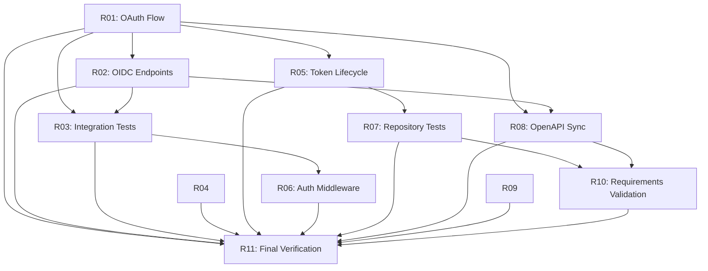

# Identity V2 Master Remediation Plan

**Plan Date**: November 23, 2025
**Status**: ACTIVE - Foundation completion required before production
**Baseline**: Post-analysis of actual implementation vs documentation claims
**Goal**: Production-ready OAuth 2.1 / OIDC identity platform

---

## Executive Summary

### Current Reality

**CRITICAL FINDING**: Advanced features (MFA, WebAuthn, hardware credentials) are production-ready, but **foundation is broken** - OAuth 2.1 authorization code flow non-functional due to 27 CRITICAL TODO comments.

| Status | Tasks | Percentage |
|--------|-------|------------|
| ✅ Complete & Verified | 9/20 | 45% |
| ⚠️ Documented Complete but Has Gaps | 5/20 | 25% |
| ❌ Incomplete/Blocked | 6/20 | 30% |

### Production Blockers

1. 🔴 **Authorization Code Flow**: 16 TODOs block OAuth 2.1 flow (Task 06)
2. 🔴 **Login/Consent UI**: No HTML login page, consent storage missing (Task 10.5)
3. 🔴 **Token-User Association**: Tokens use random UUIDs, not real user IDs (Task 06/08)
4. 🔴 **Logout Broken**: Logout endpoint doesn't revoke tokens or clear sessions (Task 10.5)
5. 🔴 **Userinfo Non-Functional**: 4 TODO steps prevent OIDC userinfo endpoint from working (Task 10.5)
6. ⚠️ **Client Secret Security**: Plain text comparison instead of bcrypt/argon2 (Task 07)
7. ⚠️ **Token Lifecycle**: No cleanup jobs for expired tokens/sessions (Task 08)

### Remediation Approach

**Foundation First**: Complete OAuth 2.1 authorization code flow and OIDC core endpoints before leveraging advanced features.

**Timeline**: 11.5 days (assumes full-time focus)

---

## Remediation Tasks

### 🔴 WEEK 1: Critical Path - OAuth 2.1 Foundation (Days 1-5)

#### R01: Complete OAuth 2.1 Authorization Code Flow (Task 06 Remediation)

**Priority**: 🔴 CRITICAL
**Effort**: 2 days (16 hours)
**Dependencies**: None
**Files**: `internal/identity/authz/handlers_authorize.go`, `handlers_token.go`

**Objectives**:

1. Implement authorization request persistence with PKCE challenge storage
2. Redirect to IdP login/consent flow (not JSON response)
3. Store consent decisions and generate authorization codes
4. Replace placeholder user IDs with real user associations
5. Enforce single-use authorization codes
6. Add comprehensive integration tests

**Current State**: 16 TODO comments block flow
**Target State**: End-to-end authorization code flow functional

**Deliverables**:

- Authorization request persistence (database storage, not in-memory)
- PKCE challenge storage and validation
- Redirect to `/oidc/v1/login` with request_id parameter
- Consent decision storage with user/client/scope tracking
- Authorization code generation tied to user ID (not random UUID)
- Integration test: client → authorize → login → consent → code → token (with real user ID)

**Acceptance Criteria**:

- ✅ `/oauth2/v1/authorize` stores request and redirects to login
- ✅ User login associates real user ID with authorization request
- ✅ Consent approval generates authorization code with user context
- ✅ `/oauth2/v1/token` exchanges code for tokens with real user ID (not placeholder)
- ✅ Authorization code single-use enforced
- ✅ Integration test validates end-to-end flow
- ✅ Zero TODO comments remain in authorization flow

**See**: `historical/REMEDIATION-MASTER-PLAN-2025.md` Task R01 for detailed implementation steps

---

#### R02: Complete OIDC Core Endpoints (Task 10.5 Remediation)

**Priority**: 🔴 CRITICAL
**Effort**: 2 days (16 hours)
**Dependencies**: R01 (authorization flow)
**Files**: `internal/identity/idp/handlers_login.go`, `handlers_consent.go`, `handlers_logout.go`, `handlers_userinfo.go`, `middleware.go`

**Objectives**:

1. Implement login UI (HTML form, not JSON response)
2. Complete consent page rendering and decision storage
3. Implement logout functionality (token revocation, session deletion, cookie clearing)
4. Implement userinfo endpoint (token introspection, user fetch, claims mapping)
5. Add authentication middleware for protected endpoints

**Current State**: 11 TODO comments block OIDC compliance
**Target State**: OIDC endpoints fully functional

**Deliverables**:

**D2.1: Login UI** (4 hours)
- HTML login form (username/password)
- CSRF protection
- Session creation on successful authentication
- Redirect to consent page with original request context

**D2.2: Consent Flow** (4 hours)
- Fetch client details from repository
- Render consent page with scopes and client information
- Store consent decision (user, client, scopes, expiration)
- Generate authorization code
- Redirect to client callback with code and state

**D2.3: Logout Implementation** (4 hours)
- Validate session exists
- Revoke all tokens associated with session
- Delete session from repository
- Clear session cookie
- Redirect to post-logout URL or confirmation page

**D2.4: Userinfo Endpoint** (4 hours)
- Parse Bearer token from Authorization header
- Introspect/validate token (expiration, signature)
- Fetch user details from repository
- Map user claims to OIDC standard claims (sub, name, email, profile, etc.)
- Return JSON response with claims

**D2.5: Authentication Middleware** (2 hours)
- Session validation middleware
- Token validation middleware
- Apply to protected endpoints (/userinfo, /logout, /consent)

**Acceptance Criteria**:

- ✅ `/oidc/v1/login` returns HTML form (not JSON)
- ✅ `/oidc/v1/consent` stores decision and generates code
- ✅ `/oidc/v1/logout` revokes tokens, deletes session, clears cookie
- ✅ `/oidc/v1/userinfo` returns user claims from valid Bearer token
- ✅ Protected endpoints require authentication (401 Unauthorized if not authenticated)
- ✅ Integration test validates complete OIDC flow
- ✅ Zero TODO comments remain in OIDC endpoints

**See**: `historical/REMEDIATION-MASTER-PLAN-2025.md` Task R02 for detailed implementation steps

---

#### R03: Integration Testing for Foundation (1 day)

**Priority**: 🔴 CRITICAL
**Effort**: 1 day (8 hours)
**Dependencies**: R01, R02
**Files**: `internal/identity/test/e2e/oauth_flows_test.go`, `test/integration/`

**Objectives**:

1. Validate end-to-end OAuth 2.1 authorization code flow
2. Test OIDC discovery and userinfo endpoints
3. Verify token lifecycle (generation, validation, revocation)
4. Test error cases (invalid code, expired token, etc.)

**Deliverables**:

- E2E test: Full authorization code flow with real user authentication
- E2E test: OIDC userinfo endpoint with token introspection
- E2E test: Logout and token revocation
- Integration test: Token cleanup jobs
- Error case coverage (401, 400 responses)

**Acceptance Criteria**:

- ✅ All E2E tests pass without mock data
- ✅ Integration tests validate repository interactions
- ✅ Code coverage ≥85% for authz and idp packages
- ✅ No test failures or flakiness

---

### ⚠️ WEEK 2: Security Hardening (Days 6-10)

#### R04: Client Authentication Security Hardening (Task 07 Remediation)

**Priority**: ⚠️ HIGH (Security vulnerability)
**Effort**: 1.5 days (12 hours)
**Dependencies**: None (can run in parallel with R01-R03)
**Files**: `internal/identity/authz/clientauth/basic.go`, `post.go`, `certificate_validator.go`

**Objectives**:

1. Implement client secret hashing (bcrypt or argon2)
2. Migrate existing plain text secrets to hashed secrets
3. Add CRL/OCSP certificate revocation checking
4. Add certificate subject/fingerprint validation

**Current State**: 5 TODO comments = security vulnerabilities
**Target State**: Production-grade client authentication security

**Deliverables**:

**D4.1: Client Secret Hashing** (6 hours)
- Replace plain text comparison with bcrypt/argon2
- Migration script for existing client secrets
- Update client creation API to hash secrets
- Add secret validation tests

**D4.2: Certificate Revocation Checking** (4 hours)
- Implement CRL checking
- Implement OCSP checking
- Add configuration for revocation check timeout
- Add tests for revoked certificate rejection

**D4.3: Certificate Validation Enhancements** (2 hours)
- Validate certificate subject matches client registration
- Validate certificate fingerprint matches stored value
- Add configuration options for validation strictness

**Acceptance Criteria**:

- ✅ Client secrets hashed with bcrypt/argon2 (not plain text)
- ✅ Existing secrets migrated to hashed format
- ✅ CRL/OCSP revocation checking operational
- ✅ Certificate subject/fingerprint validation functional
- ✅ Security tests validate attack prevention
- ✅ Zero security-related TODO comments remain

---

#### R05: Token Lifecycle Management (Task 08 Remediation)

**Priority**: ⚠️ HIGH (Resource leak)
**Effort**: 1.5 days (12 hours)
**Dependencies**: R01 (real user IDs)
**Files**: `internal/identity/jobs/cleanup.go`, `repository/token_repository.go`, `repository/session_repository.go`

**Objectives**:

1. Implement token cleanup job (delete expired tokens)
2. Implement session cleanup job (delete expired sessions)
3. Add repository methods: `DeleteExpiredBefore(time.Time)`
4. Schedule cleanup jobs to run periodically

**Current State**: 2 TODO comments = token/session leaks
**Target State**: Automatic cleanup of expired credentials

**Deliverables**:

**D5.1: Repository Methods** (4 hours)
- Add `TokenRepository.DeleteExpiredBefore(ctx, time.Time) (int, error)`
- Add `SessionRepository.DeleteExpiredBefore(ctx, time.Time) (int, error)`
- Add tests for bulk deletion

**D5.2: Cleanup Job Implementation** (6 hours)
- Implement token cleanup job
- Implement session cleanup job
- Add configuration for cleanup intervals
- Add metrics (tokens/sessions deleted)
- Add error handling and retry logic

**D5.3: Job Scheduler Integration** (2 hours)
- Schedule cleanup jobs to run every hour
- Add graceful shutdown for cleanup jobs
- Add health check for job execution status

**Acceptance Criteria**:

- ✅ Expired tokens automatically deleted
- ✅ Expired sessions automatically deleted
- ✅ Cleanup runs every hour (configurable)
- ✅ Metrics track cleanup operations
- ✅ Tests validate cleanup logic
- ✅ Zero cleanup-related TODO comments remain

---

#### R06: Authentication Middleware and Session Management

**Priority**: ⚠️ HIGH (Security)
**Effort**: 1 day (8 hours)
**Dependencies**: R02 (OIDC endpoints)
**Files**: `internal/identity/idp/middleware.go`

**Objectives**:

1. Implement session validation middleware
2. Implement token validation middleware
3. Apply middleware to protected endpoints
4. Add session storage and retrieval

**Deliverables**:

- Session validation middleware (cookie-based)
- Token validation middleware (Bearer token)
- Middleware applied to `/userinfo`, `/logout`, `/consent`
- Session storage (in-memory or database)
- Tests for authentication enforcement

**Acceptance Criteria**:

- ✅ Unauthenticated requests to protected endpoints return 401
- ✅ Valid session/token grants access to protected endpoints
- ✅ Middleware tests validate authentication logic
- ✅ Zero middleware TODO comments remain

---

### 📋 WEEK 3: Testing, Documentation, Sync (Days 11-14)

#### R07: Complete Repository Integration Tests (Task 05 Remediation)

**Priority**: 📋 MEDIUM
**Effort**: 1 day (8 hours)
**Dependencies**: R05 (repository methods)
**Files**: `internal/identity/test/integration/repository_integration_test.go`

**Objectives**:

1. Replace integration test skeleton with comprehensive tests
2. Test all repository CRUD operations
3. Test cross-DB compatibility (SQLite, PostgreSQL)
4. Test transaction rollback scenarios

**Deliverables**:

- Integration tests for User, Client, Token, Session repositories
- SQLite and PostgreSQL test runs
- Transaction rollback tests
- Error case coverage

**Acceptance Criteria**:

- ✅ Integration test skeleton TODO removed
- ✅ All repository methods tested
- ✅ Tests pass on SQLite and PostgreSQL
- ✅ Code coverage ≥85% for repository package

---

#### R08: OpenAPI Specification Synchronization (Task 10.7 Remediation)

**Priority**: 📋 MEDIUM
**Effort**: 1.5 days (12 hours)
**Dependencies**: R01, R02 (functional endpoints)
**Files**: `api/identity/*.yaml`, `api/identity/generate.go`

**Objectives**:

1. Update OpenAPI specs to match actual implementation
2. Remove TODO endpoint placeholders
3. Regenerate client libraries with oapi-codegen
4. Update Swagger UI documentation

**Deliverables**:

- Synchronized OpenAPI 3.0 specs (authz, idp)
- Updated endpoint definitions (request/response schemas)
- Regenerated Go client libraries
- Updated Swagger UI (accessible at `/ui/swagger`)

**Acceptance Criteria**:

- ✅ OpenAPI specs match actual endpoints
- ✅ Client libraries functional (can call all endpoints)
- ✅ Swagger UI reflects real API
- ✅ No placeholder/TODO endpoints in specs

---

#### R09: Configuration Normalization (Task 03 Remediation)

**Priority**: 📋 MEDIUM
**Effort**: 1 day (8 hours)
**Dependencies**: None
**Files**: `configs/identity/`, `internal/cmd/cicd/`

**Objectives**:

1. Create canonical configuration templates
2. Implement configuration validation tooling
3. Add schema enforcement

**Deliverables**:

- Configuration templates (dev, test, prod)
- Validation cicd command: `identity-config-validate`
- Schema validation (YAML/JSON schema)
- Documentation for configuration options

**Acceptance Criteria**:

- ✅ Canonical templates available
- ✅ Validation tooling functional
- ✅ Pre-commit hook validates configs
- ✅ Documentation complete

---

#### R10: Requirements Validation Automation (Task 02 Remediation)

**Priority**: 📋 MEDIUM
**Effort**: 1 day (8 hours)
**Dependencies**: R07, R08 (tests and docs complete)
**Files**: `docs/02-identityV2/requirements.yml`, `internal/cmd/cicd/`

**Objectives**:

1. Implement requirements traceability tooling
2. Map requirements to tests
3. Generate requirements coverage report

**Deliverables**:

- Requirements traceability tool: `identity-requirements-check`
- Requirements → Test mapping
- Coverage report generation
- CI/CD integration

**Acceptance Criteria**:

- ✅ All requirements mapped to tests
- ✅ Coverage report shows requirement status
- ✅ CI/CD runs requirements check
- ✅ Documentation explains traceability process

---

#### R11: Final Verification and Production Readiness

**Priority**: 🔴 CRITICAL
**Effort**: 1.5 days (12 hours)
**Dependencies**: R01-R10 (all remediation tasks)
**Files**: All identity packages

**Objectives**:

1. Run full regression test suite
2. Verify all TODO comments resolved
3. Validate production deployment checklist
4. Generate final readiness report

**Deliverables**:

- Full test suite execution (unit, integration, E2E)
- TODO comment scan (zero CRITICAL/HIGH TODOs)
- Production deployment checklist
- Readiness report (go/no-go decision)

**Acceptance Criteria**:

- ✅ All tests passing (zero failures)
- ✅ Zero CRITICAL/HIGH TODO comments
- ✅ Code coverage ≥85% for identity packages
- ✅ Production deployment checklist complete
- ✅ Readiness report approved

---

## Task Dependencies



---

## Execution Guidelines

### Task Execution Rules

1. **Sequential Execution**: Complete tasks in order (R01 → R02 → ... → R11)
2. **Parallel Opportunities**: R04 can run parallel to R01-R03 (independent)
3. **Commit After Every Task**: Git commit with conventional format after each task completion
4. **Quality Gates**: All tests passing, linting clean, documentation updated before marking complete
5. **Continuous Integration**: Run integration tests after each task to catch regressions early

### Quality Standards

- **Code Coverage**: ≥85% for identity packages (infrastructure code standard)
- **Test Coverage**: Unit + Integration + E2E for all critical paths
- **Documentation**: Update README, runbooks, OpenAPI specs with each task
- **Linting**: Zero golangci-lint violations before commit
- **TODO Comments**: Zero CRITICAL/HIGH TODOs at task completion

### Success Criteria

**Production Readiness**: All remediation tasks (R01-R11) complete

**Acceptance**:

- ✅ OAuth 2.1 authorization code flow end-to-end functional
- ✅ OIDC endpoints (login, consent, logout, userinfo) operational
- ✅ Tokens associated with real users (not random UUIDs)
- ✅ Client authentication security hardened (hashed secrets, revocation checking)
- ✅ Token/session lifecycle managed (automatic cleanup)
- ✅ Integration tests comprehensive (≥85% coverage)
- ✅ OpenAPI specs synchronized with implementation
- ✅ Zero CRITICAL/HIGH TODO comments

---

## Risk Management

### High Risks

| Risk | Mitigation |
|------|------------|
| **Foundation Changes Break Advanced Features** | Run full test suite after each task; MFA/WebAuthn tests validate advanced features still work |
| **Database Migration Issues** | Test migrations on SQLite and PostgreSQL; maintain backward compatibility |
| **Integration Test Flakiness** | Use `t.Parallel()` carefully; ensure test isolation with unique data (UUIDv7) |
| **OpenAPI Spec Divergence** | Validate generated clients against actual endpoints; automate spec generation from code |

### Medium Risks

| Risk | Mitigation |
|------|------------|
| **Configuration Complexity** | Use canonical templates; validate configs in CI/CD |
| **Documentation Drift** | Update docs as part of each task; require doc updates in PR checklist |
| **Testing Time** | Use targeted test runs during development; full suite before commit |

---

## Monitoring and Metrics

### Progress Tracking

- **Daily Standups**: Review task progress, blockers, next steps
- **Weekly Reviews**: Assess overall remediation progress, adjust timeline as needed
- **Burn-down Chart**: Track remaining TODO comments (target: zero by R11)

### Key Metrics

| Metric | Target | Current |
|--------|--------|---------|
| **TODO Comments (CRITICAL)** | 0 | 27 |
| **TODO Comments (HIGH)** | 0 | 7 |
| **Code Coverage (identity packages)** | ≥85% | ~80% |
| **Integration Test Coverage** | 100% endpoints | ~50% |
| **OpenAPI Spec Sync** | 100% | 0% |

---

## Historical Context

**Previous Plans**:

- `historical/identityV2_master.md` - Original 20-task plan (Tasks 01-20)
- `historical/REMEDIATION-MASTER-PLAN-2025.md` - First remediation attempt (Tasks R01-R11)

**Current Plan**: Based on actual implementation analysis, focuses on completing foundation before leveraging advanced features.

**Key Lesson**: Advanced features (MFA, WebAuthn, hardware credentials) implemented before foundation complete - resulted in production-ready features sitting on broken OAuth 2.1 base.

---

## Appendices

### See Also

- **ANALYSIS-TIMELINE.md**: Comprehensive timeline of all work completed
- **COMPLETION-STATUS-REPORT.md**: Detailed completion status with evidence from code
- **historical/gap-analysis.md**: 55 identified gaps with severity classification
- **historical/REMEDIATION-MASTER-PLAN-2025.md**: Detailed implementation steps for each task

### Reference Implementation

- **Task 11 (MFA)**: Exemplar implementation with comprehensive testing, telemetry, concurrency safety
- **Task 14 (WebAuthn)**: Production-ready WebAuthn implementation
- **Task 15 (Hardware Credentials)**: End-to-end hardware credential support

### Quick Start

To begin remediation:

```bash
# 1. Review current state
cat docs/02-identityV2/COMPLETION-STATUS-REPORT.md

# 2. Read detailed implementation steps
cat docs/02-identityV2/historical/REMEDIATION-MASTER-PLAN-2025.md

# 3. Start with R01 (OAuth Flow)
# Implement authorization request persistence
# See historical/REMEDIATION-MASTER-PLAN-2025.md Task R01 for details

# 4. Run tests after each change
go test ./internal/identity/authz/... -v
go test ./internal/identity/test/e2e/... -v

# 5. Commit when task complete
git add .
git commit -m "feat(identity): complete R01 - OAuth 2.1 authorization code flow"
```

---

**Master Plan Created**: November 23, 2025
**Status**: ACTIVE - Foundation remediation required
**Timeline**: 11.5 days (assumes full-time focus)
**Next Step**: Execute R01 (OAuth 2.1 Authorization Code Flow)
