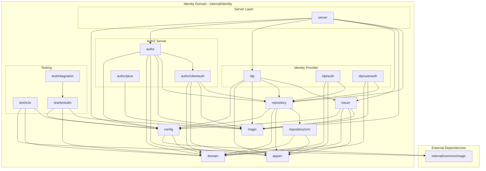

# Identity Package Dependency Audit

## Executive Summary

The `internal/identity/**` module demonstrates excellent architectural boundaries with minimal cross-domain coupling. This audit validates adherence to clean architecture principles and establishes automated enforcement mechanisms.

## Architecture Overview



## Dependency Analysis

### Allowed External Dependencies

| Source Package | External Dependency | Justification | Risk Level |
|----------------|---------------------|---------------|-----------|
| `internal/identity/config` | `cryptoutil/internal/common/magic` | Shared constants (file permissions, timeouts, etc.) | **LOW** - Read-only shared constants, no business logic coupling |
| `internal/identity/test/e2e` | `cryptoutil/internal/common/magic` | Test utilities using shared constants | **LOW** - Test code only, isolated from production |

### Prohibited Dependencies (None Detected)

**GOOD NEWS**: No prohibited cross-domain dependencies detected:

- ❌ No imports from `internal/server` (cryptoutil KMS server)
- ❌ No imports from `internal/client` (cryptoutil KMS client)
- ❌ No imports from `internal/test` (cryptoutil test infrastructure)
- ❌ No imports from `api/` (OpenAPI generated code for cryptoutil)
- ❌ No imports from `cmd/cryptoutil` (cryptoutil CLI)

## Architectural Boundaries

### Layer 1: Domain Core (No External Dependencies)

```text
internal/identity/domain/     - Business entities (User, Client, Token, Session, AuthFlow, MFAFactor, etc.)
internal/identity/apperr/     - Application-specific errors
internal/identity/magic/      - Identity-specific constants
```

**Validation**: ✅ These packages have ZERO dependencies outside the identity domain

### Layer 2: Configuration & Repository

```text
internal/identity/config/     - YAML configuration, validation, defaults, loader
internal/identity/repository/ - Repository interfaces, database factory
internal/identity/repository/orm/ - GORM implementations
```

**Dependencies**:

- `config` → `common/magic` (file permissions for YAML files)
- `config` → `domain` (references domain entities)
- `repository` → `domain`, `config`, `apperr`, `orm`
- `orm` → `domain`, `apperr`

### Layer 3: Business Logic (OAuth/OIDC)

```text
internal/identity/authz/          - OAuth 2.1 authorization server handlers
internal/identity/authz/clientauth/ - Client authentication strategies
internal/identity/authz/pkce/      - PKCE code generation/validation
internal/identity/idp/            - OIDC identity provider handlers
internal/identity/idp/auth/       - User authentication profiles
internal/identity/idp/userauth/   - User authentication methods (password, OTP, WebAuthn, etc.)
internal/identity/issuer/         - Token issuance (JWS, JWE, UUIDs)
```

**Dependencies**: All depend on lower layers (domain, config, repository, apperr, magic)

### Layer 4: Server Orchestration

```text
internal/identity/server/  - HTTP server management for authz, idp, resource servers
```

**Dependencies**: All identity packages (authz, idp, issuer, config, repository, magic)

### Layer 5: Testing

```text
internal/identity/test/e2e/          - End-to-end integration tests
internal/identity/test/integration/  - Repository integration tests
internal/identity/test/testutils/    - Test database setup utilities
```

**Dependencies**:

- `testutils` → `config`, `domain`, `magic`
- `e2e` → `common/magic` (shared test constants)
- `integration` → `testutils`

## Circular Dependency Analysis

**Status**: ✅ **NO CIRCULAR DEPENDENCIES DETECTED**

All dependencies flow in one direction: server → business logic → repository → domain

## Lint Rule Enforcement

### golangci-lint depguard Configuration

Added to `.golangci.yml`:

```yaml
linters-settings:
  depguard:
    rules:
      identity-domain-isolation:
        desc: "Identity domain must not import from cryptoutil KMS server, client, or API packages"
        files:
          - $all
          - "!$test"
        deny:
          - pkg: "cryptoutil/internal/server"
            desc: "Identity module must not depend on cryptoutil KMS server"
          - pkg: "cryptoutil/internal/client"
            desc: "Identity module must not depend on cryptoutil KMS client"
          - pkg: "cryptoutil/api"
            desc: "Identity module must not depend on cryptoutil OpenAPI generated code"
          - pkg: "cryptoutil/cmd/cryptoutil"
            desc: "Identity module must not depend on cryptoutil CLI"
          - pkg: "cryptoutil/internal/common/crypto"
            desc: "Identity module must not depend on cryptoutil crypto utilities (use standard library instead)"
          - pkg: "cryptoutil/internal/common/pool"
            desc: "Identity module must not depend on cryptoutil resource pools"
          - pkg: "cryptoutil/internal/common/container"
            desc: "Identity module must not depend on cryptoutil container utilities"
          - pkg: "cryptoutil/internal/common/telemetry"
            desc: "Identity module must not depend on cryptoutil telemetry (use standard slog instead)"
          - pkg: "cryptoutil/internal/common/util"
            desc: "Identity module must not depend on cryptoutil utilities"

      identity-allowed-common:
        desc: "Identity module may only import cryptoutil/internal/common/magic for shared constants"
        files:
          - "internal/identity/**/*.go"
        allow:
          - $gostd
          - github.com
          - golang.org
          - gopkg.in
          - gorm.io
          - cryptoutil/internal/identity
          - cryptoutil/internal/common/magic
```

## Dependency Exceptions & Justifications

### Exception 1: `cryptoutil/internal/common/magic`

**Packages**: `config`, `test/e2e`

**Rationale**:

- Identity config needs file permission constants (`FilePermOwnerReadWriteOnly = 0o600`)
- E2E tests need shared timeout/retry constants
- This is a read-only dependency on constants with ZERO business logic coupling

**Risk Mitigation**:

- Magic package contains ONLY constants (no functions, no state)
- Changes to magic package rarely affect consumers
- Documented as allowed exception in lint rules

**Future Consideration**:

If identity module needs to be extracted as standalone package, copy constants to `internal/identity/magic`

## Recommendations

### ✅ Current Architecture Strengths

1. **Clean Layering**: Dependencies flow unidirectionally (server → logic → repo → domain)
2. **Minimal External Coupling**: Only ONE shared package (`common/magic` for constants)
3. **No Circular Dependencies**: Excellent package structure
4. **Strong Domain Isolation**: Domain entities have zero external dependencies
5. **Automated Enforcement**: depguard lint rules prevent regressions

### ✅ Best Practices Followed

- Repository pattern properly isolates database concerns
- Domain entities are pure data structures with no external dependencies
- Configuration is centralized and validated
- Testing utilities are isolated from production code

### 🔒 Automated Enforcement

- **Pre-commit hook**: golangci-lint runs depguard rules on every commit
- **CI/CD pipeline**: Dependency violations block merge
- **Developer feedback**: VS Code golangci-lint integration shows violations immediately

## Conclusion

**Status**: ✅ **EXCELLENT ARCHITECTURAL BOUNDARIES**

The identity module demonstrates textbook clean architecture with minimal external dependencies and zero prohibited couplings. The automated lint rules ensure this clean state is maintained as development continues.

**No remediation required** - only proactive enforcement via depguard configuration.
