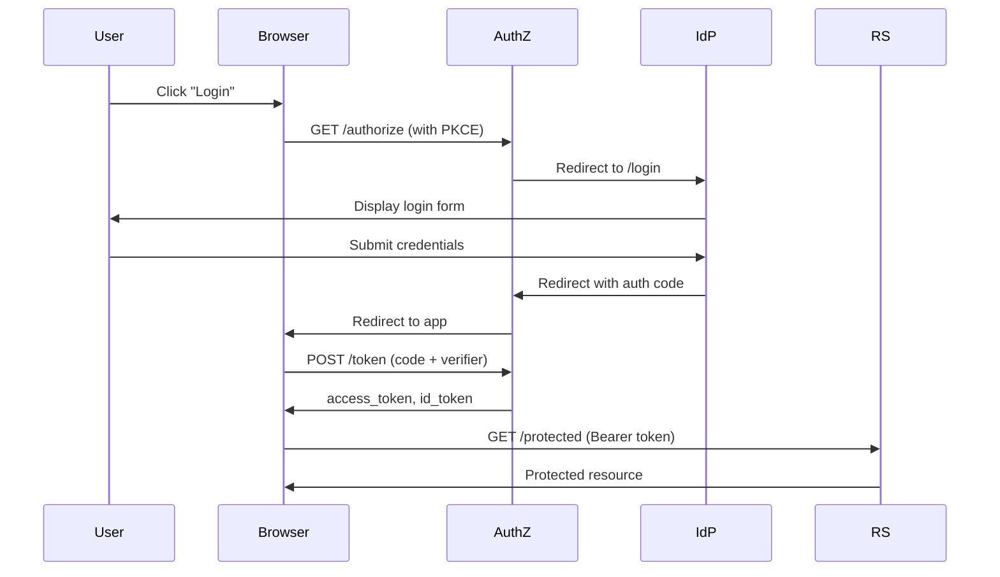

# Identity System OpenAPI Guide

## Overview

The Identity System provides comprehensive OpenAPI 3.0.3 specifications for all three services:
- **AuthZ**: OAuth 2.1 Authorization Server
- **IdP**: OpenID Connect Identity Provider
- **RS**: OAuth 2.1 Resource Server

Each service exposes its OpenAPI specification at `/ui/swagger/doc.json` and can be explored via Swagger UI.

## Accessing Swagger UI

### Local Development

Each service serves Swagger UI at `/ui/swagger` when running locally:

```bash
# Start services using unified CLI
./bin/identity start --profile demo

# Access Swagger UI for each service
# AuthZ (port 8080): https://localhost:8080/ui/swagger
# IdP (port 8081):   https://localhost:8081/ui/swagger
# RS (port 8082):    https://localhost:8082/ui/swagger
```

### OpenAPI Spec Endpoints

Retrieve the raw OpenAPI JSON specification:

```bash
# AuthZ service
curl -k https://localhost:8080/ui/swagger/doc.json

# IdP service
curl -k https://localhost:8081/ui/swagger/doc.json

# RS service
curl -k https://localhost:8082/ui/swagger/doc.json
```

## Service APIs

### Authorization Server (AuthZ)

**Base URL**: `https://localhost:8080`

**OAuth 2.1 Endpoints**:
- `POST /oauth2/v1/authorize` - Authorization code flow with mandatory PKCE
- `POST /oauth2/v1/token` - Token endpoint (3 grant types)
- `POST /oauth2/v1/introspect` - Token introspection
- `POST /oauth2/v1/revoke` - Token revocation
- `GET /health` - Service health check

**Grant Types Supported**:
1. **Authorization Code** (`authorization_code`) - For browser-based apps with PKCE S256
2. **Refresh Token** (`refresh_token`) - For obtaining new access tokens
3. **Client Credentials** (`client_credentials`) - For service-to-service authentication

**Security Schemes**:
- `clientBasicAuth` - HTTP Basic authentication with client_id/client_secret
- `clientSecretPost` - Client secret in request body (form parameter)

### Identity Provider (IdP)

**Base URL**: `https://localhost:8081`

**OIDC Endpoints**:
- `GET /oidc/v1/login` - HTML login form with CSRF token
- `POST /oidc/v1/login` - User authentication
- `GET /oidc/v1/consent` - Consent page
- `POST /oidc/v1/consent` - Consent approval
- `GET /oidc/v1/userinfo` - User information endpoint
- `POST /oidc/v1/logout` - Logout endpoint
- `GET /health` - Service health check

**Session Management**:
- Session cookie: `session_id` (HttpOnly, Secure, SameSite=Lax)
- CSRF protection: Required for all POST requests

### Resource Server (RS)

**Base URL**: `https://localhost:8082`

**API Endpoints**:
- `GET /api/v1/public/health` - Public health check (no auth)
- `GET /api/v1/protected/resource` - Protected resource (requires `read:resource` scope)
- `POST /api/v1/protected/resource` - Create resource (requires `write:resource` scope)
- `DELETE /api/v1/protected/resource/:id` - Delete resource (requires `delete:resource` scope)
- `GET /api/v1/admin/users` - Admin users endpoint (requires `admin` scope)
- `GET /api/v1/admin/metrics` - Admin metrics endpoint (requires `admin` scope)

**Security Scheme**:
- `BearerAuth` - OAuth 2.0 access token (JWT format)

## Authentication Flows

### Browser-Based Flow (Authorization Code + PKCE)



**Step-by-Step Example**:

1. **Generate PKCE Challenge**:
```bash
# Generate code_verifier (random 43-128 char string)
CODE_VERIFIER=$(openssl rand -base64 32 | tr -d "=+/" | cut -c1-43)

# Generate code_challenge (SHA256 hash, base64url encoded)
CODE_CHALLENGE=$(echo -n $CODE_VERIFIER | openssl dgst -sha256 -binary | base64 | tr -d "=" | tr "+/" "-_")
```

2. **Authorization Request**:
```bash
curl -X POST 'https://localhost:8080/oauth2/v1/authorize' \
  -H 'Content-Type: application/x-www-form-urlencoded' \
  -d 'response_type=code' \
  -d 'client_id=demo-client' \
  -d 'redirect_uri=https://localhost:3000/callback' \
  -d 'scope=openid profile email' \
  -d 'state=random-state-value' \
  -d "code_challenge=$CODE_CHALLENGE" \
  -d 'code_challenge_method=S256'
```

3. **Token Exchange**:
```bash
curl -X POST 'https://localhost:8080/oauth2/v1/token' \
  -H 'Content-Type: application/x-www-form-urlencoded' \
  -d 'grant_type=authorization_code' \
  -d 'code=AUTHORIZATION_CODE' \
  -d 'redirect_uri=https://localhost:3000/callback' \
  -d "code_verifier=$CODE_VERIFIER" \
  -d 'client_id=demo-client' \
  -d 'client_secret=demo-secret'
```

4. **Access Protected Resource**:
```bash
curl -X GET 'https://localhost:8082/api/v1/protected/resource' \
  -H 'Authorization: Bearer ACCESS_TOKEN'
```

### Service-to-Service Flow (Client Credentials)

```bash
# Obtain access token
curl -X POST 'https://localhost:8080/oauth2/v1/token' \
  -H 'Content-Type: application/x-www-form-urlencoded' \
  -H 'Authorization: Basic BASE64(client_id:client_secret)' \
  -d 'grant_type=client_credentials' \
  -d 'scope=read:resource write:resource'

# Use access token
curl -X GET 'https://localhost:8082/api/v1/protected/resource' \
  -H 'Authorization: Bearer ACCESS_TOKEN'
```

### Refresh Token Flow

```bash
curl -X POST 'https://localhost:8080/oauth2/v1/token' \
  -H 'Content-Type: application/x-www-form-urlencoded' \
  -d 'grant_type=refresh_token' \
  -d 'refresh_token=REFRESH_TOKEN' \
  -d 'client_id=demo-client' \
  -d 'client_secret=demo-secret' \
  -d 'scope=openid profile'  # Optional: narrow scopes
```

## Schema Reference

### Common Response Types

#### HealthResponse
```json
{
  "status": "healthy",     // "healthy" or "unhealthy"
  "database": "ok",        // "ok" or "error"
  "uptime": 86400          // Seconds since startup
}
```

#### OAuth2Error
```json
{
  "error": "invalid_request",           // RFC 6749 error code
  "error_description": "Missing code",  // Human-readable description
  "error_uri": "https://docs.example.com/errors/invalid_request"
}
```

#### ErrorResponse (IdP)
```json
{
  "error": "invalid_request",
  "error_description": "Missing required parameter: return_url"
}
```

### AuthZ Token Response

```json
{
  "access_token": "2YotnFZFEjr1zCsicMWpAA",
  "token_type": "Bearer",
  "expires_in": 3600,
  "refresh_token": "tGzv3JOkF0XG5Qx2TlKWIA",  // Optional
  "id_token": "eyJhbGc...",                   // Optional (if 'openid' scope)
  "scope": "openid profile email"
}
```

### RS Response Types

#### ProtectedResourceResponse
```json
{
  "message": "Protected resource accessed successfully",
  "data": {
    "user_id": "user123",
    "resource_type": "document",
    "resource_id": "doc456"
  }
}
```

## Client Code Generation

All three services use `oapi-codegen` to generate type-safe HTTP clients from the OpenAPI specs:

```bash
# Regenerate clients after spec changes
cd api/identity
go generate
```

**Using Generated Clients**:

```go
import (
    cryptoutilApiIdentityAuthz "cryptoutil/api/identity/authz"
    cryptoutilApiIdentityIdp "cryptoutil/api/identity/idp"
    cryptoutilApiIdentityRs "cryptoutil/api/identity/rs"
)

// Create HTTP client
httpClient := &http.Client{Timeout: 30 * time.Second}

// AuthZ client
authzClient, err := cryptoutilApiIdentityAuthz.NewClient("https://localhost:8080", cryptoutilApiIdentityAuthz.WithHTTPClient(httpClient))

// IdP client
idpClient, err := cryptoutilApiIdentityIdp.NewClient("https://localhost:8081", cryptoutilApiIdentityIdp.WithHTTPClient(httpClient))

// RS client
rsClient, err := cryptoutilApiIdentityRs.NewClient("https://localhost:8082", cryptoutilApiIdentityRs.WithHTTPClient(httpClient))
```

## Contract Testing

The project includes contract tests that validate API responses against the OpenAPI specifications using `kin-openapi`:

```bash
# Run contract tests
go test ./internal/identity/authz -run=TestAuthZContractHealth
go test ./internal/identity/idp -run=TestIdPContractHealth
go test ./internal/identity/rs -run=TestRSContractPublicHealth
```

**Example Contract Test**:
```go
func TestAuthZContractHealth(t *testing.T) {
    // Load OpenAPI spec
    spec, err := cryptoutilApiIdentityAuthz.GetSwagger()
    require.NoError(t, err)

    // Make HTTP request
    req := httptest.NewRequest(http.MethodGet, "/health", nil)
    resp, err := app.Test(req)

    // Validate response against spec
    router, _ := gorillamux.NewRouter(spec)
    route, pathParams, _ := router.FindRoute(req)

    err = openapi3filter.ValidateResponse(ctx, &openapi3filter.ResponseValidationInput{
        RequestValidationInput: &openapi3filter.RequestValidationInput{
            Request:    req,
            PathParams: pathParams,
            Route:      route,
        },
        Status: resp.StatusCode,
        Header: resp.Header,
        Body:   io.NopCloser(bytes.NewReader(bodyBytes)),
    })
    require.NoError(t, err, "Response must match OpenAPI spec")
}
```

## Spec Validation

Validate OpenAPI specs for compliance:

```bash
# Install swagger-cli
npm install -g @apidevtools/swagger-cli

# Validate specs
swagger-cli validate api/identity/openapi_spec_authz.yaml
swagger-cli validate api/identity/openapi_spec_idp.yaml
swagger-cli validate api/identity/rs/openapi.yaml
swagger-cli validate api/identity/openapi_spec_components.yaml
```

## Best Practices

### Security

1. **PKCE Required**: All authorization code flows MUST use PKCE with S256
2. **HTTPS Only**: All endpoints require TLS (self-signed certs OK for dev)
3. **CSRF Protection**: IdP login forms include CSRF tokens
4. **Scope Validation**: RS validates required scopes for protected endpoints
5. **Token Rotation**: Use refresh tokens to obtain new access tokens

### Error Handling

1. **OAuth 2.0 Errors**: Use standard RFC 6749 error codes
2. **HTTP Status Codes**: Follow RESTful conventions (400, 401, 403, 500)
3. **Error Descriptions**: Include human-readable error messages
4. **Error URIs**: Link to documentation for error resolution

### Performance

1. **Connection Pooling**: Reuse HTTP clients across requests
2. **Timeout Configuration**: Set appropriate timeouts (30s recommended)
3. **Rate Limiting**: Implement rate limits for public endpoints
4. **Caching**: Cache OpenAPI specs and JWKs where appropriate

## Troubleshooting

### Common Issues

**Problem**: "Failed to find route in OpenAPI spec"
- **Cause**: URL path doesn't match spec exactly
- **Solution**: Check for trailing slashes, query parameters, case sensitivity

**Problem**: "Response does not match OpenAPI spec"
- **Cause**: Response schema mismatch (missing fields, wrong types)
- **Solution**: Validate response JSON against schema, check required fields

**Problem**: "Client authentication failed"
- **Cause**: Invalid credentials or wrong auth method
- **Solution**: Verify client_id/client_secret, use correct security scheme

**Problem**: "Invalid PKCE challenge"
- **Cause**: code_challenge doesn't match code_verifier
- **Solution**: Use S256 method, verify base64url encoding

## Additional Resources

- [OAuth 2.1 Specification](https://datatracker.ietf.org/doc/html/draft-ietf-oauth-v2-1-09)
- [OpenID Connect Core](https://openid.net/specs/openid-connect-core-1_0.html)
- [RFC 7636: PKCE](https://datatracker.ietf.org/doc/html/rfc7636)
- [RFC 6749: OAuth 2.0](https://datatracker.ietf.org/doc/html/rfc6749)
- [oapi-codegen Documentation](https://github.com/deepmap/oapi-codegen)
- [kin-openapi Documentation](https://github.com/getkin/kin-openapi)
