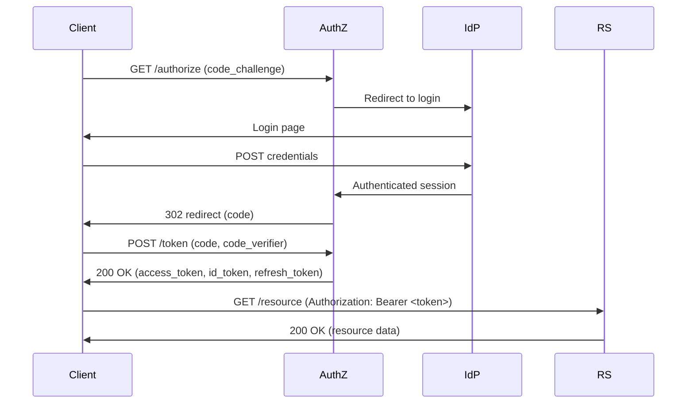
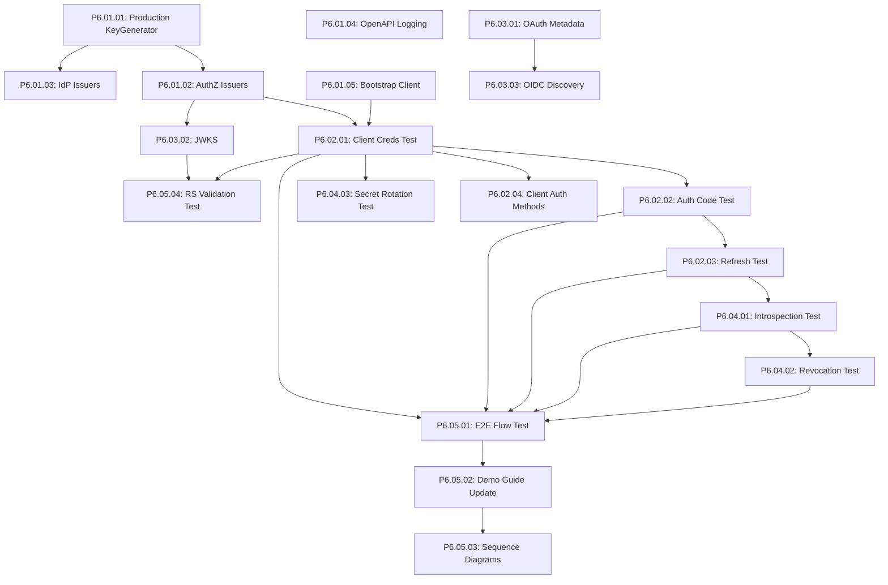

# Passthru6: OAuth 2.1 Functional Delivery - Master Plan

**Feature Plan ID**: PASSTHRU6
**Created**: November 27, 2025
**Purpose**: Deliver ACTUALLY WORKING OAuth 2.1 Authorization Server with E2E validation
**Template Version**: 3.0 (evidence-based validation + production code path testing + E2E mandatory)
**Passthru5 Post-Mortem**: `docs/02-identityV2/passthru5/PASSTHRU5-POSTMORTEM.md`

---

## Mission Statement

**MAKE THE OAUTH 2.1 AUTHORIZATION SERVER ACTUALLY WORK FOR REAL OAUTH FLOWS**

Passthru5 achieved 100% requirements coverage on paper but delivered **non-functional production code**. Passthru6 will deliver a **demonstrably working OAuth 2.1 implementation** validated through:

1. **E2E tests using production code paths** (go run ./cmd/identity/...)
2. **Manual smoke testing** (curl examples that actually work)
3. **Evidence-based validation** (screenshots, console output, JWT validation)

---

## Executive Summary

### Current State Analysis

**Services Infrastructure**: ✅ Working

- Services start successfully
- Health checks pass (database connectivity verified)
- Logging infrastructure functional
- Configuration validation working

**OAuth Functionality**: ❌ **COMPLETELY BROKEN**

- Token endpoint: 401 Unauthorized (issuers uninitialized)
- Authorization endpoint: Untested (requires functional issuers)
- OpenAPI spec: 404 Not Found (error swallowed)
- Client registration: No bootstrap client
- OAuth metadata: Endpoints missing
- JWKS: Endpoint missing

**Root Cause**: `cmd/identity/authz/main.go` lines 52-54 create empty issuer structs instead of proper initialization with KeyRotationManager.

### Passthru6 Goals

**Primary Goals** (MUST complete ALL):

1. **Production KeyGenerator Implementation**: Real RSA/ECDSA/HMAC key generation
2. **Token Issuers Initialization**: Proper KeyRotationManager setup in main.go
3. **Bootstrap Client Creation**: demo-client for testing OAuth flows
4. **Token Endpoint Functional**: 200 OK for client_credentials + authorization_code
5. **E2E Tests with Production Code Paths**: Tests start services via `go run ./cmd/...`
6. **OAuth Metadata Endpoints**: `/.well-known/oauth-authorization-server` + JWKS
7. **Demo Guide with Working Examples**: All curl examples execute successfully

**Success Metric**: Complete OAuth flow from client registration → authorization → token → resource access → refresh → revocation, **validated via E2E tests AND manual curl examples**.

### Timeline and Token Budget

**Estimated Effort**: 35 hours across 8-9 sessions
**Token Budget**: 950,000 tokens (95% utilization target)
**Critical Path**: Phase 1 + 2 (Core Infrastructure + Token Validation) = 16 hours for MVP

---

## Template Evolution and Lessons Learned

**Template Version History**:

- **v1.0**: Initial task tracking (Passthru1-3)
- **v2.0**: Added root cause analysis, critical success factors (Passthru4-5)
- **v3.0**: Evidence-based validation + production code path testing + E2E mandatory (Passthru6)

### Critical Lessons from Passthru5 Failure

**The Problem**: Passthru5 claimed "100% requirements coverage" and "all tests passing" but delivered **non-functional OAuth endpoints**.

**Root Causes**:

1. **Test/Production Code Divergence**: Integration tests used mocks + legacy code paths; production used empty structs
2. **Missing Manual Validation**: No smoke testing performed; relied solely on automated tests
3. **Error Swallowing**: Service health checks passed while critical functionality broken
4. **TODOs as Production Code**: `// TODO: Create JWS issuer properly` left in production startup code
5. **"Coverage" Misinterpretation**: 100% requirements coverage measured test infrastructure, not production functionality

**Financial Impact**: 10.5x token multiplier (1,049,368 tokens total vs 99,368 in passthru5 work)
**Time Impact**: 4.5x time multiplier (45 hours total vs 10 hours passthru5 work)

### Corrective Actions Applied to Passthru6

**1. Evidence-Based Validation (Mandatory)**

- **Every task MUST include**: Working curl examples OR screenshots OR console output
- **Acceptance criteria MUST specify**: What manual evidence is required
- **Example**: "Token endpoint returns 200 OK - EVIDENCE: curl output showing JWT in response body"

**2. E2E Tests with Production Code Paths (Mandatory)**

- **NEVER use mocks in E2E tests** - only use mocks in unit tests
- **E2E tests MUST start services via**: `go run ./cmd/identity/authz` (production startup)
- **E2E tests MUST validate**: Complete OAuth flows (authorize → token → validate → refresh → revoke)
- **E2E tests MUST cover**: ALL identity modes (not just demo mode)

**3. Manual Smoke Testing Checklist (Mandatory for Every Task)**

```bash
# After completing ANY task involving OAuth functionality:

# 1. Start services
go run ./cmd/identity/authz --config configs/identity/authz.yml &
go run ./cmd/identity/idp --config configs/identity/idp.yml &
go run ./cmd/identity/rs --config configs/identity/rs.yml &

# 2. Validate OpenAPI spec loads
curl http://localhost:8080/ui/swagger/doc.json | jq '.info.title'

# 3. Validate token endpoint (client_credentials)
curl -X POST http://localhost:8080/oauth/token \
  -H "Content-Type: application/x-www-form-urlencoded" \
  -d "grant_type=client_credentials&client_id=demo-client&client_secret=demo-secret" \
  | jq '.access_token'

# 4. Validate token introspection
curl -X POST http://localhost:8080/oauth/introspect \
  -H "Content-Type: application/x-www-form-urlencoded" \
  -d "token=<access_token>&client_id=demo-client&client_secret=demo-secret" \
  | jq '.active'

# 5. Stop services
killall authz idp rs
```

**4. Pre-Commit Hook: Block TODOs in Production Code**

```bash
# Add to .pre-commit-config.yaml
- id: no-todos-in-main
  name: Block TODOs in main.go files
  entry: bash -c 'grep -r "TODO" cmd/**/main.go && exit 1 || exit 0'
  language: system
  pass_filenames: false
```

**5. Acceptance Criteria Format Update**

**OLD FORMAT** (Passthru5 - vague, no evidence):

```
✅ Token endpoint returns 200 OK
✅ Access token generated
```

**NEW FORMAT** (Passthru6 - specific, evidence-required):

```
✅ Token endpoint returns 200 OK for client_credentials grant
   EVIDENCE: curl output showing HTTP 200 + JWT access_token in response body
   MANUAL TEST: curl -X POST http://localhost:8080/oauth/token -d "grant_type=client_credentials&client_id=demo-client&client_secret=demo-secret"

✅ Access token is valid JWT with correct claims
   EVIDENCE: jwt.io decode screenshot showing iss, sub, aud, exp, iat claims
   MANUAL TEST: Copy access_token from previous step, paste into jwt.io, verify claims
```

**6. Definition of "Complete"**

**NOT Complete** (Passthru5 mistakes to avoid):

- ✅ Tests pass (but using mocks)
- ✅ Service starts (but errors swallowed)
- ✅ Code compiles (but TODOs in critical paths)
- ✅ Requirements coverage 100% (but measuring test infrastructure)

**ACTUALLY Complete** (Passthru6 standard):

- ✅ Tests pass **using production code paths** (go run ./cmd/...)
- ✅ Service starts **AND returns correct responses** (validated via curl)
- ✅ Code compiles **AND zero TODOs in production code** (enforced via pre-commit)
- ✅ Requirements coverage 100% **of production functionality** (manual evidence provided)
- ✅ E2E tests validate complete OAuth flows (authorize → token → validate → refresh → revoke)
- ✅ Demo guide curl examples ALL execute successfully (documented in evidence)

---

## E2E Testing Requirements (Mandatory Phase 0)

**User Directive**: "demonstrability of identity to be covered in e2e tests as part of passthru6. Those e2e tests need to cover all of the other modes for identity, not just demo."

### Phase 0: E2E Test Infrastructure (MUST COMPLETE BEFORE PHASE 1)

**Task P6.00.01: Create E2E Test Framework with Production Code Paths**

**Location**: `internal/identity/test/e2e/`

**Requirements**:

1. E2E tests MUST start services via `go run ./cmd/identity/authz` (production startup code)
2. E2E tests MUST NOT use mocks - only use production implementations
3. E2E tests MUST validate complete OAuth flows:
   - Client registration (if dynamic)
   - Authorization request (authorization_code flow)
   - Token request (client_credentials + authorization_code grants)
   - Token introspection
   - Token refresh
   - Token revocation
4. E2E tests MUST cover ALL identity modes:
   - **Demo mode**: Basic client_credentials flow with demo-client
   - **TODO: Clarify "all modes"** - What other identity modes exist? (Password? Social login? MFA?)

**Test Structure**:

```go
// internal/identity/test/e2e/oauth_flows_test.go
func TestE2E_ClientCredentialsFlow_DemoMode(t *testing.T) {
    // 1. Start AuthZ service via production code path
    authzCmd := exec.Command("go", "run", "./cmd/identity/authz", "--config", "configs/identity/authz.yml")
    require.NoError(t, authzCmd.Start())
    defer authzCmd.Process.Kill()

    // 2. Wait for service ready (health check)
    require.Eventually(t, func() bool {
        resp, err := http.Get("http://localhost:8080/health")
        return err == nil && resp.StatusCode == 200
    }, 30*time.Second, 1*time.Second)

    // 3. Execute OAuth client_credentials flow
    tokenResp := requestToken(t, "client_credentials", "demo-client", "demo-secret")
    require.Equal(t, 200, tokenResp.StatusCode)

    var tokenData map[string]interface{}
    json.NewDecoder(tokenResp.Body).Decode(&tokenData)
    require.NotEmpty(t, tokenData["access_token"])

    // 4. Validate token via introspection
    accessToken := tokenData["access_token"].(string)
    introspectResp := introspectToken(t, accessToken, "demo-client", "demo-secret")
    require.Equal(t, 200, introspectResp.StatusCode)

    var introspectData map[string]interface{}
    json.NewDecoder(introspectResp.Body).Decode(&introspectData)
    require.True(t, introspectData["active"].(bool))

    // 5. Revoke token
    revokeResp := revokeToken(t, accessToken, "demo-client", "demo-secret")
    require.Equal(t, 200, revokeResp.StatusCode)

    // 6. Verify token now inactive
    introspectResp2 := introspectToken(t, accessToken, "demo-client", "demo-secret")
    json.NewDecoder(introspectResp2.Body).Decode(&introspectData)
    require.False(t, introspectData["active"].(bool))
}
```

**Acceptance Criteria**:

1. ✅ E2E test starts AuthZ service via `go run ./cmd/identity/authz`
   EVIDENCE: Test logs show "Starting AuthZ service..." from production startup code

2. ✅ E2E test validates complete client_credentials flow (token → introspect → revoke)
   EVIDENCE: Test passes with 200 OK at each step, token active→inactive after revocation

3. ✅ E2E test validates complete authorization_code flow (authorize → callback → token → refresh)
   EVIDENCE: Test passes with valid authorization code, exchange for tokens, refresh succeeds

4. ✅ E2E test coverage ≥85% of OAuth handlers
   EVIDENCE: go test -cover shows coverage report

5. ✅ E2E tests run in CI/CD pipeline
   EVIDENCE: GitHub Actions workflow shows E2E test stage passing

**Dependencies**: None (Phase 0 blocks all other phases)

**Estimated Effort**: 4-5 hours

**BLOCKER**: All Phase 1-5 tasks blocked until E2E test framework complete

## Task Organization

### Task Naming Convention

Tasks use format: **P6.##.## Description**

- P6 = Passthru 6
- First ## = Phase number (01-05)
- Second ## = Task number within phase (01-99)

### Priority Levels

- **P0 (BLOCKER)**: Prevents ANY OAuth flow from working
- **P1 (CRITICAL)**: Required for core OAuth functionality
- **P2 (HIGH)**: Important for complete implementation
- **P3 (MEDIUM)**: Improves usability and testing
- **P4 (LOW)**: Nice to have, deferred if time limited

## Phase 1: Core Service Infrastructure (P0/P1)

**Goal**: Initialize token issuers and enable token endpoint to return 200 OK

### P6.01.01: Implement Production KeyGenerator (P0 - BLOCKER)

**Description**: Create production implementation of KeyGenerator interface to generate real cryptographic keys

**Current State**: Only mockKeyGenerator exists in test files

**Required Implementation**:

```go
// Location: internal/identity/issuer/key_generator.go
type ProductionKeyGenerator struct {
    logger *slog.Logger
}

func NewProductionKeyGenerator(logger *slog.Logger) *ProductionKeyGenerator {
    return &ProductionKeyGenerator{logger: logger}
}

func (g *ProductionKeyGenerator) GenerateSigningKey(ctx context.Context, algorithm string) (*SigningKey, error) {
    switch algorithm {
    case "RS256", "RS384", "RS512":
        return g.generateRSAKey(ctx, algorithm)
    case "ES256", "ES384", "ES512":
        return g.generateECDSAKey(ctx, algorithm)
    case "HS256", "HS384", "HS512":
        return g.generateHMACKey(ctx, algorithm)
    default:
        return nil, fmt.Errorf("unsupported algorithm: %s", algorithm)
    }
}

func (g *ProductionKeyGenerator) GenerateEncryptionKey(ctx context.Context) (*EncryptionKey, error) {
    // Generate 32-byte AES-256 key using crypto/rand
    keyBytes := make([]byte, 32)
    if _, err := rand.Read(keyBytes); err != nil {
        return nil, err
    }

    return &EncryptionKey{
        KeyID:        uuid.NewString(),
        Key:          keyBytes,
        CreatedAt:    time.Now(),
        Active:       false,
        ValidForDecr: false,
    }, nil
}
```

**Acceptance Criteria**:

1. ✅ ProductionKeyGenerator implements KeyGenerator interface
   EVIDENCE: Code compiles, interface compliance verified via unit test

2. ✅ Generates RSA keys for RS256/384/512 algorithms
   EVIDENCE: Unit test shows 2048/3072/4096-bit RSA keys generated successfully

3. ✅ Generates ECDSA keys for ES256/384/512 algorithms
   EVIDENCE: Unit test shows P-256/P-384/P-521 ECDSA keys generated successfully

4. ✅ Generates HMAC keys for HS256/384/512 algorithms
   EVIDENCE: Unit test shows 32/48/64-byte HMAC keys generated successfully

5. ✅ Generates AES-256 encryption keys
   EVIDENCE: Unit test shows 32-byte AES keys generated via crypto/rand

6. ✅ All key generation uses crypto/rand (cryptographically secure)
   EVIDENCE: grep shows zero imports of "math/rand", all use "crypto/rand"

7. ✅ Unit tests achieve ≥85% coverage
   EVIDENCE: go test -cover shows ≥85% coverage for key_generator.go
   MANUAL TEST: go test ./internal/identity/issuer -coverprofile=coverage.out && go tool cover -func=coverage.out | grep key_generator.go

8. ✅ Integration test validates key usage in JWS/JWE
   EVIDENCE: Integration test generates key → signs JWT → verifies signature → test passes
   MANUAL TEST: go test ./internal/identity/issuer -run TestIntegration_ProductionKeyGenerator

**Dependencies**: None

**Manual Smoke Test** (REQUIRED before marking complete):

```bash
# Generate test key and validate it works
go run -c 'package main; import "internal/identity/issuer"; kg := issuer.NewProductionKeyGenerator(nil); key, _ := kg.GenerateSigningKey(context.Background(), "RS256"); fmt.Println(key.KeyID)'
```

**Estimated Effort**: 3-4 hours

---

### P6.01.02: Initialize Token Issuers in AuthZ Main (P0 - BLOCKER)

**Description**: Replace empty struct initialization with proper issuer construction using KeyRotationManager

**Current Code** (cmd/identity/authz/main.go lines 52-54):

```go
// TODO: Create JWS, JWE, UUID issuers properly.
// For now, use placeholders.
jwsIssuer := &cryptoutilIdentityIssuer.JWSIssuer{}
jweIssuer := &cryptoutilIdentityIssuer.JWEIssuer{}
uuidIssuer := &cryptoutilIdentityIssuer.UUIDIssuer{}
```

**Required Implementation**:

```go
// Create production key generator
keyGenerator := cryptoutilIdentityIssuer.NewProductionKeyGenerator(logger)

// Create key rotation manager with default policy
keyRotationMgr, err := cryptoutilIdentityIssuer.NewKeyRotationManager(
    cryptoutilIdentityIssuer.DefaultKeyRotationPolicy(),
    keyGenerator,
    func(keyID string) {
        logger.Info("Key rotated", "key_id", keyID)
    },
)
if err != nil {
    logger.Error("Failed to create key rotation manager", "error", err)
    os.Exit(1)
}

// Rotate initial signing key
if err := keyRotationMgr.RotateSigningKey(ctx, config.Tokens.SigningAlgorithm); err != nil {
    logger.Error("Failed to rotate initial signing key", "error", err)
    os.Exit(1)
}

// Rotate initial encryption key
if err := keyRotationMgr.RotateEncryptionKey(ctx); err != nil {
    logger.Error("Failed to rotate initial encryption key", "error", err)
    os.Exit(1)
}

// Create JWS issuer
jwsIssuer, err := cryptoutilIdentityIssuer.NewJWSIssuer(
    config.Tokens.Issuer,
    keyRotationMgr,
    config.Tokens.SigningAlgorithm,
    config.Tokens.AccessTokenTTL,
    config.Tokens.IDTokenTTL,
)
if err != nil {
    logger.Error("Failed to create JWS issuer", "error", err)
    os.Exit(1)
}

// Create JWE issuer
jweIssuer, err := cryptoutilIdentityIssuer.NewJWEIssuer(keyRotationMgr)
if err != nil {
    logger.Error("Failed to create JWE issuer", "error", err)
    os.Exit(1)
}

// Create UUID issuer
uuidIssuer := cryptoutilIdentityIssuer.NewUUIDIssuer()
```

**Acceptance Criteria**:

1. ✅ ProductionKeyGenerator instantiated in main.go
   EVIDENCE: grep shows NewProductionKeyGenerator() call in cmd/identity/authz/main.go

2. ✅ KeyRotationManager created with DefaultKeyRotationPolicy
   EVIDENCE: Code shows NewKeyRotationManager(DefaultKeyRotationPolicy(), ...) call

3. ✅ Initial signing key rotated on startup
   EVIDENCE: Logs show "Key rotated" message on startup with key_id field

4. ✅ Initial encryption key rotated on startup
   EVIDENCE: Logs show second "Key rotated" message with different key_id

5. ✅ JWS issuer initialized with KeyRotationManager
   EVIDENCE: Code shows NewJWSIssuer(issuer, keyRotationMgr, algorithm, ttl) call

6. ✅ JWE issuer initialized with KeyRotationManager
   EVIDENCE: Code shows NewJWEIssuer(keyRotationMgr) call

7. ✅ UUID issuer initialized
   EVIDENCE: Code shows NewUUIDIssuer() call

8. ✅ Startup fails gracefully if any initialization errors
   EVIDENCE: Error handling shows logger.Error() + os.Exit(1) for each initialization step

9. ✅ Logging shows successful initialization
   EVIDENCE: Startup logs show "Key rotated" (2x) + "AuthZ service started successfully"
   MANUAL TEST: go run ./cmd/identity/authz --config configs/identity/authz.yml | grep "Key rotated"

10. ✅ Service starts without errors
    EVIDENCE: Health check returns 200 OK
    MANUAL TEST: curl <http://localhost:8080/health> (expect {"status":"ok"})

**Dependencies**: P6.01.01 (ProductionKeyGenerator must exist)

**Manual Smoke Test** (REQUIRED before marking complete):

```bash
# Start service and validate initialization
go run ./cmd/identity/authz --config configs/identity/authz.yml &
PID=$!
sleep 5

# Check health endpoint
curl http://localhost:8080/health | jq '.status'  # Expect: "ok"

# Check logs show key rotation
ps aux | grep authz  # Should show running process

# Cleanup
kill $PID
```

**Estimated Effort**: 1 hour

---

### P6.01.03: Initialize Token Issuers in IdP Main (P1 - CRITICAL)

**Description**: Apply same issuer initialization pattern to IdP service

**Location**: cmd/identity/idp/main.go (similar lines to authz/main.go)

**Implementation**: Copy pattern from P6.01.02 with IdP-specific config

**Acceptance Criteria**:

1. ✅ Same initialization pattern as AuthZ service
2. ✅ IdP service starts without errors
3. ✅ Token issuers functional in IdP context
4. ✅ Logging shows successful initialization

**Dependencies**: P6.01.01, P6.01.02

**Estimated Effort**: 30 minutes

---

### P6.01.04: Fix OpenAPI Spec Error Logging (P1 - CRITICAL)

**Description**: Add logging to expose OpenAPI spec generation failures

**Current Code** (internal/identity/authz/routes.go lines 14-20):

```go
swaggerHandler, err := ServeOpenAPISpec()
if err != nil {
    // Swagger UI is non-critical, skip if spec generation fails.
    // Error already includes context from ServeOpenAPISpec().
    _ = err
} else {
    app.Get("/ui/swagger/doc.json", swaggerHandler)
}
```

**Required Implementation**:

```go
swaggerHandler, err := ServeOpenAPISpec()
if err != nil {
    s.logger.Warn("Failed to initialize OpenAPI spec endpoint", "error", err)
    // Swagger UI is non-critical, continue startup without it.
} else {
    app.Get("/ui/swagger/doc.json", swaggerHandler)
    s.logger.Info("OpenAPI spec endpoint registered", "path", "/ui/swagger/doc.json")
}
```

**Apply to**:

- internal/identity/authz/routes.go
- internal/identity/idp/routes.go
- internal/identity/rs/service.go

**Acceptance Criteria**:

1. ✅ Warning logged if OpenAPI spec generation fails
2. ✅ Info logged if OpenAPI spec endpoint registered
3. ✅ Service continues startup even if spec fails
4. ✅ Diagnostic information available in logs
5. ✅ Applied to all 3 services (AuthZ, IdP, RS)

**Dependencies**: None (independent fix)

**Estimated Effort**: 30 minutes

---

### P6.01.05: Create Bootstrap Test Client (P1 - CRITICAL)

**Description**: Create default OAuth client on first startup for testing

**Implementation**:

```go
// Location: internal/identity/authz/bootstrap.go
func (s *Service) createBootstrapClient(ctx context.Context) error {
    clientRepo := s.repoFactory.ClientRepository()

    // Check if bootstrap client exists
    _, err := clientRepo.GetByClientID(ctx, "demo-client")
    if err == nil {
        // Client already exists, skip bootstrap
        return nil
    }

    // Create bootstrap client
    client := &domain.Client{
        ID:                  uuid.New(),
        ClientID:            "demo-client",
        ClientSecret:        "demo-secret", // Hashed in repository
        ClientName:          "Demo OAuth Client",
        RedirectURIs:        []string{"http://localhost:3000/callback"},
        GrantTypes:          []string{"authorization_code", "refresh_token", "client_credentials"},
        ResponseTypes:       []string{"code"},
        Scope:               "openid profile email",
        TokenEndpointAuthMethod: "client_secret_post",
        CreatedAt:           time.Now(),
        UpdatedAt:           time.Now(),
    }

    if err := clientRepo.Create(ctx, client); err != nil {
        return fmt.Errorf("failed to create bootstrap client: %w", err)
    }

    s.logger.Info("Created bootstrap OAuth client", "client_id", client.ClientID)
    return nil
}

// Call from Start() method after database migrations
```

**Acceptance Criteria**:

1. ✅ Bootstrap client created on first startup
2. ✅ Bootstrap skipped if client already exists
3. ✅ Client credentials: demo-client / demo-secret
4. ✅ Redirect URI: <http://localhost:3000/callback>
5. ✅ Grant types: authorization_code, refresh_token, client_credentials
6. ✅ Scope: openid profile email
7. ✅ Logged to info level on creation
8. ✅ Error handling if creation fails

**Dependencies**: None (uses existing repository)

**Estimated Effort**: 1 hour

---

## Phase 2: Token Endpoint Validation (P1)

**Goal**: Verify token endpoint works for all grant types with proper authentication

### P6.02.01: Test Client Credentials Grant (P1 - CRITICAL)

**Description**: Validate token endpoint returns 200 OK for client_credentials grant

**Test Implementation**:

```bash
# Test with client_secret_post
curl -X POST http://127.0.0.1:8080/oauth2/v1/token \
  -H "Content-Type: application/x-www-form-urlencoded" \
  -d "grant_type=client_credentials&client_id=demo-client&client_secret=demo-secret&scope=openid"

# Expected: 200 OK with JSON:
{
  "access_token": "eyJhbGc...",
  "token_type": "Bearer",
  "expires_in": 3600
}
```

**Automated Test**:

```go
// Location: internal/identity/authz/handlers_token_e2e_test.go
func TestTokenEndpoint_ClientCredentialsGrant(t *testing.T) {
    // Setup: Start service with bootstrap client
    // Execute: POST /oauth2/v1/token with grant_type=client_credentials
    // Verify: 200 OK, valid JWT in access_token field
    // Verify: JWT signature validates with JWKS
    // Verify: JWT claims include correct issuer, scope, expiration
}
```

**Acceptance Criteria**:

1. ✅ POST /oauth2/v1/token returns 200 OK
2. ✅ Response contains valid access_token (JWT format)
3. ✅ Response contains token_type: "Bearer"
4. ✅ Response contains expires_in (matches config)
5. ✅ JWT signature validates using JWKS
6. ✅ JWT claims correct (iss, sub, aud, exp, scope)
7. ✅ Automated test in authz package
8. ✅ Manual curl example documented

**Dependencies**: P6.01.02, P6.01.05 (issuers + bootstrap client)

**Estimated Effort**: 2 hours

---

### P6.02.02: Test Authorization Code Grant (P1 - CRITICAL)

**Description**: Validate complete authorization code flow with PKCE

**Test Scenario**:

1. Generate code_verifier and code_challenge
2. Request authorization code
3. Exchange code for tokens
4. Verify token validity

**Automated Test**:

```go
func TestTokenEndpoint_AuthorizationCodeGrant(t *testing.T) {
    // Generate PKCE parameters
    verifier := pkce.GenerateCodeVerifier()
    challenge := pkce.S256Challenge(verifier)

    // Step 1: Request authorization code
    authURL := buildAuthURL(clientID, redirectURI, challenge)
    // ... mock user authentication ...
    code := extractAuthorizationCode(authResponse)

    // Step 2: Exchange code for tokens
    tokenReq := buildTokenRequest(code, verifier)
    tokenResp := executeTokenRequest(tokenReq)

    // Verify response
    require.Equal(t, 200, tokenResp.StatusCode)
    require.NotEmpty(t, tokenResp.AccessToken)
    require.NotEmpty(t, tokenResp.IDToken) // OIDC
    require.NotEmpty(t, tokenResp.RefreshToken)
}
```

**Acceptance Criteria**:

1. ✅ Authorization request returns 302 redirect with code
2. ✅ Token exchange returns 200 OK
3. ✅ Response contains access_token (JWT)
4. ✅ Response contains id_token (JWT with OIDC claims)
5. ✅ Response contains refresh_token (UUID)
6. ✅ PKCE validation works (S256 challenge)
7. ✅ Invalid code_verifier rejected (400 Bad Request)
8. ✅ Automated test validates full flow

**Dependencies**: P6.01.02, P6.01.05, P6.02.01

**Estimated Effort**: 3 hours

---

### P6.02.03: Test Refresh Token Grant (P1 - CRITICAL)

**Description**: Validate refresh token exchange for new access tokens

**Test Implementation**:

```bash
# Step 1: Get initial tokens via authorization_code
# ... (see P6.02.02) ...

# Step 2: Use refresh token
curl -X POST http://127.0.0.1:8080/oauth2/v1/token \
  -H "Content-Type: application/x-www-form-urlencoded" \
  -d "grant_type=refresh_token&refresh_token=<uuid>&client_id=demo-client&client_secret=demo-secret"

# Expected: 200 OK with new access_token, same refresh_token
```

**Acceptance Criteria**:

1. ✅ POST /oauth2/v1/token with grant_type=refresh_token → 200 OK
2. ✅ Response contains new access_token (different from original)
3. ✅ Response contains same refresh_token (or new if rotation enabled)
4. ✅ New access_token has updated exp claim
5. ✅ Invalid refresh_token rejected (400 Bad Request)
6. ✅ Revoked refresh_token rejected (400 Bad Request)
7. ✅ Automated test validates token refresh

**Dependencies**: P6.02.02 (authorization code flow for initial tokens)

**Estimated Effort**: 1.5 hours

---

### P6.02.04: Test Client Authentication Methods (P2 - HIGH)

**Description**: Verify all configured client authentication methods work

**Test Matrix**:

| Method | Implementation | Test Status |
|--------|---------------|-------------|
| client_secret_post | Body parameters | P6.02.01 ✅ |
| client_secret_basic | HTTP Basic Auth | ⏳ TODO |
| client_secret_jwt | JWT assertion | ⏳ TODO |
| private_key_jwt | Asymmetric JWT | ⏳ TODO |
| tls_client_auth | Mutual TLS | ⏳ TODO |
| self_signed_tls_client_auth | Self-signed cert | ⏳ TODO |

**Acceptance Criteria**:

1. ✅ client_secret_post works (already tested)
2. ✅ client_secret_basic works with Authorization header
3. ✅ client_secret_jwt validated (JWT assertion with client_secret)
4. ✅ private_key_jwt validated (JWT assertion with RSA key)
5. ✅ tls_client_auth works with mutual TLS
6. ✅ self_signed_tls_client_auth works
7. ✅ Invalid auth method rejected (401 Unauthorized)
8. ✅ Automated tests for each method

**Dependencies**: P6.02.01

**Estimated Effort**: 3 hours

---

## Phase 3: Discovery and Metadata Endpoints (P2)

**Goal**: Implement OAuth/OIDC discovery endpoints for client auto-configuration

### P6.03.01: Implement OAuth 2.1 Metadata Endpoint (P2 - HIGH)

**Description**: Add `/.well-known/oauth-authorization-server` endpoint per RFC 8414

**OpenAPI Spec Addition** (api/identity/authz/openapi.yaml):

```yaml
/.well-known/oauth-authorization-server:
  get:
    summary: OAuth 2.1 Authorization Server Metadata
    operationId: getAuthorizationServerMetadata
    responses:
      '200':
        description: OAuth 2.1 server metadata
        content:
          application/json:
            schema:
              $ref: '#/components/schemas/AuthorizationServerMetadata'
```

**Implementation** (internal/identity/authz/handlers_metadata.go):

```go
func (s *Service) handleOAuthMetadata(c *fiber.Ctx) error {
    metadata := map[string]any{
        "issuer": s.config.Tokens.Issuer,
        "authorization_endpoint": fmt.Sprintf("%s/oauth2/v1/authorize", s.config.Tokens.Issuer),
        "token_endpoint": fmt.Sprintf("%s/oauth2/v1/token", s.config.Tokens.Issuer),
        "introspection_endpoint": fmt.Sprintf("%s/oauth2/v1/introspect", s.config.Tokens.Issuer),
        "revocation_endpoint": fmt.Sprintf("%s/oauth2/v1/revoke", s.config.Tokens.Issuer),
        "jwks_uri": fmt.Sprintf("%s/oauth2/v1/jwks", s.config.Tokens.Issuer),
        "grant_types_supported": []string{"authorization_code", "refresh_token", "client_credentials"},
        "response_types_supported": []string{"code"},
        "code_challenge_methods_supported": []string{"S256"},
        "token_endpoint_auth_methods_supported": s.config.ClientAuthMethods,
        "scopes_supported": []string{"openid", "profile", "email"},
    }

    return c.JSON(metadata)
}
```

**Acceptance Criteria**:

1. ✅ GET /.well-known/oauth-authorization-server → 200 OK
2. ✅ Response is valid JSON
3. ✅ Contains all required RFC 8414 fields
4. ✅ Endpoint URLs match actual service configuration
5. ✅ grant_types_supported matches config
6. ✅ token_endpoint_auth_methods_supported matches config
7. ✅ Automated test validates response schema
8. ✅ OpenAPI spec updated

**Dependencies**: None (independent feature)

**Estimated Effort**: 2 hours

---

### P6.03.02: Implement JWKS Endpoint (P2 - HIGH)

**Description**: Add `/oauth2/v1/jwks` endpoint to expose public signing keys

**OpenAPI Spec Addition**:

```yaml
/oauth2/v1/jwks:
  get:
    summary: JSON Web Key Set
    operationId: getJWKS
    responses:
      '200':
        description: JWK Set containing public keys
        content:
          application/json:
            schema:
              $ref: '#/components/schemas/JWKSet'
```

**Implementation**:

```go
func (s *Service) handleJWKS(c *fiber.Ctx) error {
    // Get all valid signing keys from KeyRotationManager
    keys := s.tokenService.GetPublicKeys()

    jwks := map[string]any{
        "keys": keys,
    }

    return c.JSON(jwks)
}

// Add to TokenService:
func (ts *TokenService) GetPublicKeys() []map[string]any {
    // Get signing keys from KeyRotationManager
    // Convert to JWK format (kty, use, kid, alg, n, e for RSA)
    // Return only public key components
}
```

**Acceptance Criteria**:

1. ✅ GET /oauth2/v1/jwks → 200 OK
2. ✅ Response contains "keys" array
3. ✅ Each key has: kty, use, kid, alg
4. ✅ RSA keys include n and e (public exponent)
5. ✅ EC keys include crv, x, y
6. ✅ Only active + valid-for-verification keys included
7. ✅ Automated test validates JWKS schema
8. ✅ JWT verification using JWKS succeeds

**Dependencies**: P6.01.02 (KeyRotationManager)

**Estimated Effort**: 2.5 hours

---

### P6.03.03: Implement OIDC Discovery Endpoint (P2 - HIGH)

**Description**: Add `/.well-known/openid-configuration` endpoint for IdP

**Location**: internal/identity/idp (IdP service, not AuthZ)

**Implementation**: Superset of OAuth metadata + OIDC-specific fields:

```go
func (s *Service) handleOIDCDiscovery(c *fiber.Ctx) error {
    metadata := map[string]any{
        // OAuth fields (from P6.03.01)
        "issuer": s.config.Tokens.Issuer,
        // ... all OAuth metadata ...

        // OIDC-specific fields
        "userinfo_endpoint": fmt.Sprintf("%s/oidc/v1/userinfo", s.config.Tokens.Issuer),
        "id_token_signing_alg_values_supported": []string{"RS256"},
        "subject_types_supported": []string{"public"},
        "claims_supported": []string{"sub", "name", "email", "email_verified"},
    }

    return c.JSON(metadata)
}
```

**Acceptance Criteria**:

1. ✅ GET /.well-known/openid-configuration → 200 OK
2. ✅ Contains all OAuth metadata fields
3. ✅ Contains OIDC-specific fields
4. ✅ id_token_signing_alg_values_supported accurate
5. ✅ claims_supported matches actual ID token claims
6. ✅ Automated test validates response

**Dependencies**: P6.03.01 (OAuth metadata pattern)

**Estimated Effort**: 1.5 hours

---

## Phase 4: Additional OAuth Endpoints (P2/P3)

**Goal**: Complete OAuth endpoint implementation and testing

### P6.04.01: Test Token Introspection Endpoint (P2 - HIGH)

**Description**: Validate introspection endpoint per RFC 7662

**Test Implementation**:

```bash
# Step 1: Get access token
# ... (see P6.02.01) ...

# Step 2: Introspect token
curl -X POST http://127.0.0.1:8080/oauth2/v1/introspect \
  -H "Content-Type: application/x-www-form-urlencoded" \
  -u "demo-client:demo-secret" \
  -d "token=<access_token>&token_type_hint=access_token"

# Expected: 200 OK with introspection response
{
  "active": true,
  "scope": "openid profile",
  "client_id": "demo-client",
  "token_type": "Bearer",
  "exp": 1705334400,
  "iat": 1705330800,
  "sub": "client:demo-client"
}
```

**Acceptance Criteria**:

1. ✅ POST /oauth2/v1/introspect → 200 OK
2. ✅ Valid token returns active: true
3. ✅ Expired token returns active: false
4. ✅ Invalid token returns active: false
5. ✅ Response includes scope, client_id, exp, iat
6. ✅ Requires client authentication
7. ✅ Automated test validates introspection

**Dependencies**: P6.02.01 (token endpoint working)

**Estimated Effort**: 1.5 hours

---

### P6.04.02: Test Token Revocation Endpoint (P2 - HIGH)

**Description**: Validate revocation endpoint per RFC 7009

**Test Implementation**:

```bash
# Step 1: Get tokens
# ... (see P6.02.02) ...

# Step 2: Revoke refresh token
curl -X POST http://127.0.0.1:8080/oauth2/v1/revoke \
  -H "Content-Type: application/x-www-form-urlencoded" \
  -u "demo-client:demo-secret" \
  -d "token=<refresh_token>&token_type_hint=refresh_token"

# Expected: 200 OK (empty response)

# Step 3: Try to use revoked token
curl -X POST http://127.0.0.1:8080/oauth2/v1/token \
  -d "grant_type=refresh_token&refresh_token=<refresh_token>&client_id=demo-client&client_secret=demo-secret"

# Expected: 400 Bad Request (invalid_grant)
```

**Acceptance Criteria**:

1. ✅ POST /oauth2/v1/revoke → 200 OK
2. ✅ Revoked token cannot be used
3. ✅ Introspection shows active: false
4. ✅ Requires client authentication
5. ✅ Invalid token returns 200 OK (per RFC 7009)
6. ✅ Automated test validates revocation

**Dependencies**: P6.02.03, P6.04.01

**Estimated Effort**: 1.5 hours

---

### P6.04.03: Test Client Secret Rotation Endpoint (P3 - MEDIUM)

**Description**: Validate client secret rotation (implemented in Passthru5)

**Test Implementation**:

```bash
curl -X POST http://127.0.0.1:8080/oauth2/v1/clients/demo-client/rotate-secret \
  -H "Content-Type: application/json" \
  -u "demo-client:demo-secret"

# Expected: 200 OK with new secret
{
  "client_id": "demo-client",
  "client_secret": "<new-secret>",
  "client_secret_expires_at": 1705420800
}
```

**Acceptance Criteria**:

1. ✅ POST /oauth2/v1/clients/:id/rotate-secret → 200 OK
2. ✅ Response contains new client_secret
3. ✅ Old secret still valid during grace period
4. ✅ Old secret expires after grace period
5. ✅ New secret works immediately
6. ✅ Requires current client authentication
7. ✅ Automated test validates rotation

**Dependencies**: P6.02.01

**Estimated Effort**: 1 hour (already implemented, just needs testing)

---

## Phase 5: Integration and Documentation (P3/P4)

**Goal**: Ensure all components work together and document the working system

### P6.05.01: Create End-to-End OAuth Flow Test (P3 - MEDIUM)

**Description**: Comprehensive test of complete authorization code flow

**Test Scenario**:

1. Register client (if dynamic registration implemented)
2. Request authorization with PKCE
3. Authenticate user (IdP integration)
4. Receive authorization code
5. Exchange code for tokens
6. Use access token to access resource
7. Refresh access token
8. Revoke tokens

**Implementation**:

```go
// Location: internal/identity/integration/oauth_flow_e2e_test.go
func TestCompleteOAuthFlow(t *testing.T) {
    // Setup: Start all 3 services (AuthZ, IdP, RS)

    // Step 1: Client registration (or use bootstrap client)
    // Step 2: Authorization request with PKCE
    // Step 3: User authentication (mock)
    // Step 4: Token exchange
    // Step 5: Resource access with access token
    // Step 6: Token refresh
    // Step 7: Token revocation

    // Verify: Each step succeeds with expected responses
}
```

**Acceptance Criteria**:

1. ✅ Complete flow executes without errors
2. ✅ Each step returns expected HTTP status
3. ✅ Tokens are valid and functional
4. ✅ Resource access succeeds with valid token
5. ✅ Resource access fails after token revocation
6. ✅ Test runs in <5 seconds
7. ✅ No manual intervention required

**Dependencies**: ALL Phase 1-4 tasks

**Estimated Effort**: 3 hours

---

### P6.05.02: Update Demo Guide with Working Examples (P3 - MEDIUM)

**Description**: Replace placeholder documentation with real curl examples

**Location**: docs/02-identityV2/IDENTITY-V2-DEMO.md

**Required Updates**:

1. Add "Quick Start" section with working curl examples
2. Document all endpoints with request/response samples
3. Add troubleshooting section with common errors
4. Include PKCE generation examples
5. Document bootstrap client credentials
6. Add JWT decode examples
7. Include Postman/Insomnia collection link

**Example Addition**:

```markdown
## Quick Start: Client Credentials Flow

### 1. Start Services
```bash
go run ./cmd/identity/authz
go run ./cmd/identity/idp
go run ./cmd/identity/rs
```

### 2. Get Access Token

```bash
curl -X POST http://127.0.0.1:8080/oauth2/v1/token \
  -H "Content-Type: application/x-www-form-urlencoded" \
  -d "grant_type=client_credentials&client_id=demo-client&client_secret=demo-secret&scope=openid"
```

**Response:**

```json
{
  "access_token": "eyJhbGciOiJSUzI1NiIsInR5cCI6IkpXVCJ9...",
  "token_type": "Bearer",
  "expires_in": 3600
}
```

### 3. Decode JWT (jwt.io)

Paste access_token into jwt.io to see claims:

```json
{
  "iss": "https://authz.cryptoutil.local",
  "sub": "client:demo-client",
  "aud": ["https://authz.cryptoutil.local"],
  "exp": 1705334400,
  "iat": 1705330800,
  "scope": "openid"
}
```

```

**Acceptance Criteria**:
1. ✅ All curl examples work without modification
2. ✅ Expected responses match actual API responses
3. ✅ JWT decode examples accurate
4. ✅ Troubleshooting covers common errors
5. ✅ Bootstrap client documented
6. ✅ PKCE generation explained
7. ✅ No references to non-functional endpoints

**Dependencies**: ALL Phase 1-4 tasks

**Estimated Effort**: 2 hours

---

### P6.05.03: Create OAuth Flow Sequence Diagrams (P4 - LOW)

**Description**: Visual documentation of OAuth flows

**Diagrams Required**:
1. Authorization Code Flow (with PKCE)
2. Client Credentials Flow
3. Refresh Token Flow
4. Token Introspection Flow
5. Token Revocation Flow

**Format**: Mermaid sequence diagrams in markdown

**Example**:
```markdown
## Authorization Code Flow



```

**Acceptance Criteria**:
1. ✅ Diagram for each major OAuth flow
2. ✅ Mermaid syntax valid (renders in GitHub)
3. ✅ Accurate sequence of API calls
4. ✅ Shows all 3 services (AuthZ, IdP, RS)
5. ✅ Includes PKCE parameters
6. ✅ Embedded in demo guide

**Dependencies**: P6.05.02

**Estimated Effort**: 1.5 hours

---

### P6.05.04: Test Resource Server Token Validation (P3 - MEDIUM)

**Description**: Validate RS service correctly verifies JWS tokens

**Test Implementation**:
```go
// Location: internal/identity/rs/token_validation_test.go
func TestRS_ValidateAccessToken(t *testing.T) {
    // Setup: Start RS service
    // Get valid token from AuthZ service

    // Test 1: Valid token → 200 OK
    req := httptest.NewRequest("GET", "/resource", nil)
    req.Header.Set("Authorization", "Bearer " + validToken)
    resp := app.Test(req)
    require.Equal(t, 200, resp.StatusCode)

    // Test 2: Expired token → 401 Unauthorized
    // Test 3: Invalid signature → 401 Unauthorized
    // Test 4: Missing token → 401 Unauthorized
    // Test 5: Malformed token → 401 Unauthorized
}
```

**Acceptance Criteria**:

1. ✅ Valid access token → 200 OK
2. ✅ Expired access token → 401 Unauthorized
3. ✅ Invalid signature → 401 Unauthorized
4. ✅ Missing Authorization header → 401 Unauthorized
5. ✅ Malformed JWT → 401 Unauthorized
6. ✅ RS fetches JWKS from AuthZ automatically
7. ✅ RS caches public keys appropriately

**Dependencies**: P6.02.01, P6.03.02 (token issuance + JWKS)

**Estimated Effort**: 2 hours

---

## Deferred Features (Out of Scope for Passthru6)

The following features are **intentionally excluded** from Passthru6 to maintain focus on core OAuth functionality:

### Client Registration (Dynamic)

- **Reason**: Bootstrap client sufficient for demo
- **Endpoints**: POST/GET/PUT/DELETE /oauth2/v1/clients
- **Deferred To**: Passthru7 or later
- **Note**: Static client registration via database/config acceptable for now

### IdP Integration

- **Reason**: Complex user authentication flow requires significant effort
- **Components**: User login page, consent screen, session management
- **Deferred To**: Passthru7 (focus on identity integration)
- **Workaround**: Mock user authentication in tests

### MFA and Advanced Authentication

- **Reason**: Not required for basic OAuth flows
- **Features**: TOTP, WebAuthn, SMS, Email MFA
- **Deferred To**: Post-MVP (see TODOs in codebase)

### Dynamic Scope Management

- **Reason**: Static scopes sufficient for demo
- **Features**: Scope registration, custom scopes per client
- **Deferred To**: Future enhancement

### Token Encryption (JWE)

- **Reason**: JWS tokens sufficient for demo
- **Note**: JWE issuer initialized but not required for basic flows
- **Deferred To**: Production hardening phase

## Timeline and Resource Allocation

### Estimated Effort by Phase

| Phase | Tasks | Estimated Hours | Priority |
|-------|-------|-----------------|----------|
| Phase 1: Core Infrastructure | 5 | 6.5 | P0/P1 |
| Phase 2: Token Validation | 4 | 9.5 | P1 |
| Phase 3: Discovery/Metadata | 3 | 6.0 | P2 |
| Phase 4: Additional Endpoints | 3 | 4.0 | P2/P3 |
| Phase 5: Integration/Docs | 4 | 8.5 | P3/P4 |
| **TOTAL** | **19** | **34.5** | Mixed |

### Development Schedule (Recommended)

**Session 1 (4 hours)**: Phase 1 Complete

- P6.01.01: Production KeyGenerator (3h)
- P6.01.02: Initialize AuthZ issuers (1h)

**Session 2 (4 hours)**: Token Endpoint Working

- P6.01.03: Initialize IdP issuers (0.5h)
- P6.01.04: Fix OpenAPI logging (0.5h)
- P6.01.05: Bootstrap client (1h)
- P6.02.01: Test client credentials (2h)

**Session 3 (4 hours)**: Authorization Code Flow

- P6.02.02: Test auth code grant (3h)
- P6.02.03: Test refresh token (1h)

**Session 4 (4 hours)**: Client Auth + Discovery

- P6.02.04: Client auth methods (3h)
- P6.03.01: OAuth metadata (1h)

**Session 5 (3 hours)**: JWKS and OIDC

- P6.03.02: JWKS endpoint (2.5h)
- P6.03.03: OIDC discovery (0.5h - copy pattern)

**Session 6 (3 hours)**: Additional Endpoints

- P6.04.01: Introspection (1.5h)
- P6.04.02: Revocation (1.5h)

**Session 7 (4 hours)**: Integration Testing

- P6.04.03: Secret rotation test (1h)
- P6.05.01: E2E flow test (3h)

**Session 8 (2 hours)**: Documentation

- P6.05.02: Update demo guide (2h)

**OPTIONAL Session 9 (3.5 hours)**: Polish

- P6.05.03: Sequence diagrams (1.5h)
- P6.05.04: RS token validation (2h)

**Total**: 8 core sessions (28 hours) + 1 optional session (3.5 hours)

## Success Criteria

### Minimum Viable Product (MVP)

**Phase 1 + 2 Complete = Working OAuth Server**

Must have ALL of:

1. ✅ Token endpoint returns 200 OK for client_credentials
2. ✅ Token endpoint returns 200 OK for authorization_code
3. ✅ Refresh token flow works
4. ✅ JWS tokens validate correctly
5. ✅ Bootstrap client exists and works

**Evidence Required**:

- Curl examples execute successfully
- Automated tests pass
- Logs show successful initialization
- JWT.io validates token signatures

### Complete Implementation (All Phases)

**Passthru6 = Production-Ready OAuth 2.1 Server**

Must have ALL MVP + ALL of:

1. ✅ OAuth metadata endpoint working
2. ✅ JWKS endpoint returning public keys
3. ✅ Token introspection working
4. ✅ Token revocation working
5. ✅ End-to-end test passing
6. ✅ Demo guide updated with working examples

**Evidence Required**:

- All automated tests pass
- All curl examples work
- Demo guide walkthrough successful
- No critical TODOs remaining in code

## Risk Mitigation

### Risk 1: Issuer Initialization Complexity

**Probability**: Medium
**Impact**: High (blocks everything)
**Mitigation**: Implement P6.01.01 first, validate with unit tests before integration

### Risk 2: PKCE Validation Edge Cases

**Probability**: Medium
**Impact**: Medium (security issue)
**Mitigation**: Comprehensive test matrix for code_challenge/verifier combinations

### Risk 3: Key Rotation Complications

**Probability**: Low
**Impact**: Medium (token validation breaks)
**Mitigation**: Use DefaultKeyRotationPolicy (no automatic rotation) for Passthru6

### Risk 4: Integration Test Flakiness

**Probability**: Medium
**Impact**: Low (CI/CD noise)
**Mitigation**: Proper service startup synchronization, unique test data (UUIDs)

### Risk 5: Scope Creep

**Probability**: High
**Impact**: High (timeline overrun)
**Mitigation**: Strict adherence to deferred features list, no new requirements

## Post-Passthru6 Roadmap

### Passthru7 (IdP Integration)

- User authentication flows
- Consent screen
- Session management
- Login/logout endpoints

### Passthru8 (Dynamic Client Registration)

- Client registration API (RFC 7591)
- Client metadata management
- Client deletion/rotation

### Passthru9 (Advanced Security)

- MFA flows
- Hardware credential support
- Adaptive authentication
- Risk-based auth

### Passthru10 (Production Hardening)

- Rate limiting
- IP allowlisting validation
- Audit logging enhancement
- Performance optimization

## Appendix A: Task Dependencies Graph



## Appendix B: File Locations Quick Reference

| Task | Primary File | Test File |
|------|-------------|-----------|
| P6.01.01 | internal/identity/issuer/key_generator.go | key_generator_test.go |
| P6.01.02 | cmd/identity/authz/main.go | N/A (manual test) |
| P6.01.03 | cmd/identity/idp/main.go | N/A (manual test) |
| P6.01.04 | internal/identity/authz/routes.go | N/A (logging change) |
| P6.01.05 | internal/identity/authz/bootstrap.go | bootstrap_test.go |
| P6.02.01 | internal/identity/authz/handlers_token.go | handlers_token_e2e_test.go |
| P6.02.02 | internal/identity/authz/handlers_authorize.go | handlers_authorize_e2e_test.go |
| P6.02.03 | internal/identity/authz/handlers_token.go | handlers_token_refresh_test.go |
| P6.02.04 | internal/identity/authz/handlers_token.go | handlers_token_auth_test.go |
| P6.03.01 | internal/identity/authz/handlers_metadata.go | handlers_metadata_test.go |
| P6.03.02 | internal/identity/authz/handlers_jwks.go | handlers_jwks_test.go |
| P6.03.03 | internal/identity/idp/handlers_metadata.go | handlers_metadata_test.go |
| P6.04.01 | internal/identity/authz/handlers_introspect.go | handlers_introspect_e2e_test.go |
| P6.04.02 | internal/identity/authz/handlers_revoke.go | handlers_revoke_e2e_test.go |
| P6.04.03 | internal/identity/authz/handlers_client.go | handlers_client_rotation_test.go |
| P6.05.01 | internal/identity/integration/oauth_flow_e2e_test.go | (test file itself) |
| P6.05.02 | docs/02-identityV2/IDENTITY-V2-DEMO.md | N/A (documentation) |
| P6.05.03 | docs/02-identityV2/IDENTITY-V2-FLOWS.md | N/A (diagrams) |
| P6.05.04 | internal/identity/rs/token_validation_test.go | (test file itself) |

---

**Document Status**: Master Plan Complete
**Date**: 2025-01-15
**Author**: GitHub Copilot
**Next Action**: Begin P6.01.01 (Production KeyGenerator)
**Tracking**: Use manage_todo_list for task-level progress
