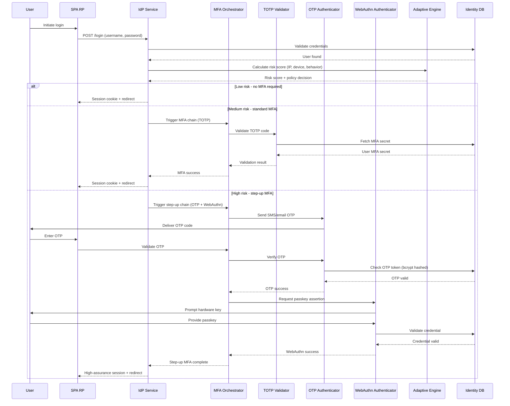
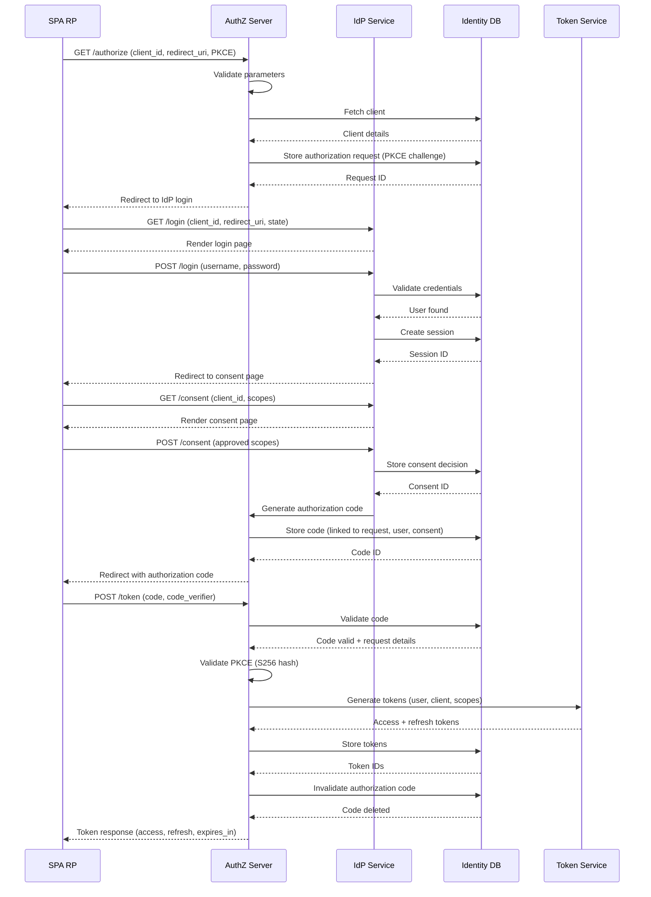
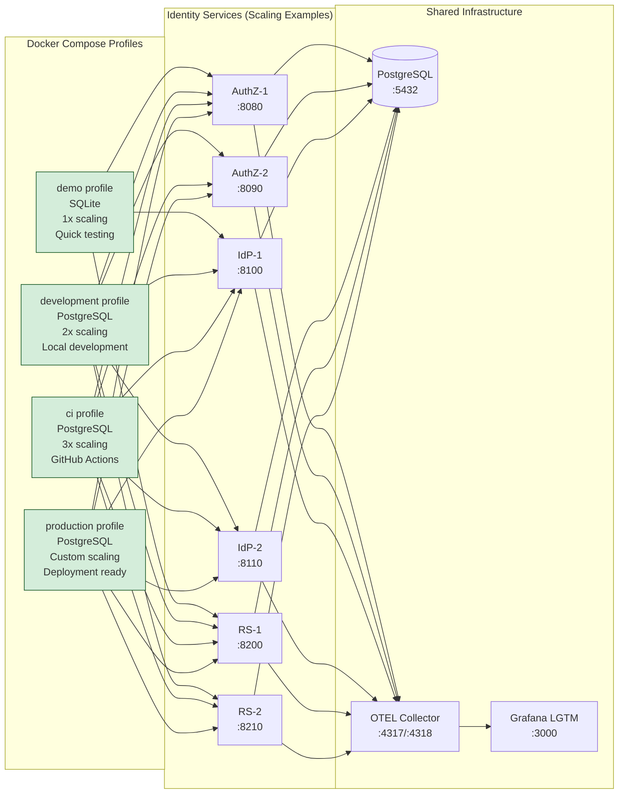

# Task 01: Architecture Diagrams - Current State

## Overview

Post-Tasks 12-20, the identity architecture has evolved significantly beyond the original baseline (commit 5c04e44). This document updates Mermaid diagrams to reflect completed orchestration, E2E testing, and advanced authentication features.

---

## Identity Services Architecture (Post-Task 20)

```mermaid
flowchart TB
    subgraph "Client Tier"
        SPA[SPA Relying Party<br/>cmd/identity/spa-rp<br/>✅ OAuth 2.1 PKCE flows]
        CLI[Identity Orchestrator CLI<br/>cmd/identity-orchestrator<br/>✅ Docker Compose management]
    end

    subgraph "Identity Services (AuthZ, IdP, RS)"
        AuthZ[Authorization Server<br/>✅ Token endpoint operational<br/>⚠️ Code persistence missing<br/>⚠️ Consent integration incomplete]
        IdP[Identity Provider<br/>✅ MFA orchestrator<br/>✅ OTP/Magic Link<br/>✅ Adaptive auth<br/>✅ WebAuthn/FIDO2<br/>⚠️ Login/consent pages stubbed]
        RS[Resource Server<br/>❌ Token validation TODO<br/>❌ Scope enforcement missing]
    end

    subgraph "Shared Infrastructure"
        DB[(Identity Database<br/>PostgreSQL/SQLite<br/>✅ GORM repositories<br/>✅ Migrations via golang-migrate)]
        TokenSvc[Token Service<br/>✅ Access/refresh tokens<br/>✅ JWT signing<br/>✅ Key rotation support]
        Cache[Session Cache<br/>✅ In-memory sessions<br/>⚠️ Cleanup job disabled]
    end

    subgraph "Docker Orchestration (Task 18)"
        Compose[identity-demo.yml<br/>✅ 4 profiles: demo/dev/ci/prod<br/>✅ Scaling: 1x, 2x, 3x<br/>✅ Docker secrets integration]
    end

    subgraph "E2E Testing Fabric (Task 19)"
        OAuthTests[OAuth Flow Tests<br/>✅ Authorization code<br/>✅ Client credentials<br/>✅ PKCE validation<br/>✅ Refresh tokens]
        FailoverTests[Failover Tests<br/>✅ AuthZ/IdP/RS scaling<br/>✅ 2x2x2x2 orchestration]
        ObsTests[Observability Tests<br/>✅ OTLP collector<br/>✅ Grafana integration<br/>✅ Prometheus metrics]
    end

    subgraph "Observability (OTEL)"
        OTELCollector[OpenTelemetry Collector<br/>✅ Traces/metrics/logs<br/>✅ Prometheus exporter]
        Grafana[Grafana LGTM Stack<br/>✅ Dashboards<br/>✅ Tempo traces<br/>✅ Loki logs<br/>✅ Prometheus metrics]
    end

    %% Client interactions
    SPA -->|Authorization Code + PKCE| AuthZ
    SPA -->|Bearer tokens| RS
    CLI -->|Start/stop/health/logs| Compose

    %% Service interactions
    AuthZ -->|User auth redirect| IdP
    IdP -->|Session + consent| AuthZ
    AuthZ -->|Issue tokens| TokenSvc
    TokenSvc -->|Store tokens| DB
    IdP -->|Validate MFA| DB
    IdP -->|Create sessions| Cache
    AuthZ & IdP & RS --> DB

    %% Orchestration
    Compose -->|Manages| AuthZ & IdP & RS

    %% E2E testing
    OAuthTests -->|Test flows| AuthZ & IdP & TokenSvc
    FailoverTests -->|Test scaling| Compose
    ObsTests -->|Validate telemetry| OTELCollector

    %% Observability pipeline
    AuthZ & IdP & RS -->|OTLP| OTELCollector
    OTELCollector -->|Traces/metrics/logs| Grafana

    style AuthZ fill:#fff3cd,stroke:#856404
    style IdP fill:#fff3cd,stroke:#856404
    style RS fill:#f8d7da,stroke:#721c24
    style SPA fill:#d4edda,stroke:#155724
    style CLI fill:#d4edda,stroke:#155724
    style Compose fill:#d4edda,stroke:#155724
    style OAuthTests fill:#d4edda,stroke:#155724
    style FailoverTests fill:#d4edda,stroke:#155724
    style ObsTests fill:#d4edda,stroke:#155724
```

**Legend**:
- 🟢 Green: Complete and working
- 🟡 Yellow: Partial implementation with TODOs
- 🔴 Red: Missing critical functionality

---

## MFA Authentication Flow (Task 11-13)

---

## OAuth 2.1 Authorization Code Flow (Current vs Expected)

### Current Implementation (Partial)

```mermaid
sequenceDiagram
    participant SPA as SPA RP
    participant AuthZ as AuthZ Server
    participant IdP as IdP Service
    participant DB as Identity DB

    SPA->>AuthZ: GET /authorize (client_id, redirect_uri, PKCE)
    AuthZ->>AuthZ: Validate parameters
    AuthZ->>DB: Fetch client
    DB-->>AuthZ: Client details

    Note over AuthZ,IdP: ❌ TODO: Authorization request storage
    Note over AuthZ,IdP: ❌ TODO: Redirect to login/consent

    AuthZ-->>SPA: Placeholder redirect (not functional)

    Note over SPA: FLOW BLOCKED - No authorization code issued
```

### Expected Implementation (Post-Task 06-09)

---

## Docker Compose Orchestration (Task 18)

---

## E2E Testing Infrastructure (Task 19)

```mermaid
flowchart TB
    subgraph "Test Suites"
        OAuth[OAuth Flow Tests<br/>oauth_flows_test.go<br/>391 lines]
        Failover[Failover Tests<br/>orchestration_failover_test.go<br/>330 lines]
        Obs[Observability Tests<br/>observability_test.go<br/>396 lines]
    end

    subgraph "Test Scenarios"
        AuthCode[Authorization Code Flow<br/>✅ PKCE validation<br/>✅ Token exchange]
        ClientCreds[Client Credentials Flow<br/>✅ Service-to-service auth]
        Introspect[Token Introspection<br/>✅ Active/inactive tokens]
        Refresh[Refresh Token Flow<br/>✅ Token rotation]
        PKCE[PKCE S256 Validation<br/>✅ Challenge/verifier]

        AuthZFailover[AuthZ Failover<br/>✅ 2x scaling<br/>✅ Instance rotation]
        IdPFailover[IdP Failover<br/>✅ 2x scaling<br/>✅ Session persistence]
        RSFailover[RS Failover<br/>✅ 2x scaling<br/>✅ Token validation]

        OTELTest[OTEL Collector Test<br/>✅ Traces/metrics/logs]
        GrafanaTest[Grafana Integration<br/>✅ Dashboard validation<br/>⚠️ API queries TODO]
        PrometheusTest[Prometheus Scraping<br/>✅ Metrics endpoints]
    end

    subgraph "Docker Orchestration"
        Compose[identity-demo.yml<br/>✅ Service lifecycle<br/>✅ Health checks<br/>✅ Secrets management]
    end

    OAuth --> AuthCode & ClientCreds & Introspect & Refresh & PKCE
    Failover --> AuthZFailover & IdPFailover & RSFailover
    Obs --> OTELTest & GrafanaTest & PrometheusTest

    AuthCode & ClientCreds & Introspect & Refresh & PKCE --> Compose
    AuthZFailover & IdPFailover & RSFailover --> Compose
    OTELTest & GrafanaTest & PrometheusTest --> Compose

    style OAuth fill:#d4edda,stroke:#155724
    style Failover fill:#d4edda,stroke:#155724
    style Obs fill:#d4edda,stroke:#155724
    style GrafanaTest fill:#fff3cd,stroke:#856404
```

---

## Critical Path Gaps (Tasks 06-10)

```mermaid
flowchart LR
    subgraph "Priority 1: Authorization Code Flow"
        Gap1[❌ Code persistence<br/>handlers_authorize.go<br/>Line 112-114]
        Gap2[❌ PKCE validation<br/>handlers_token.go<br/>Line 79]
        Gap3[❌ Consent integration<br/>handlers_consent.go<br/>Line 46-48]
    end

    subgraph "Priority 2: IdP Login/Consent"
        Gap4[❌ Login page rendering<br/>handlers_login.go<br/>Line 25]
        Gap5[❌ Consent page rendering<br/>handlers_consent.go<br/>Line 22]
        Gap6[❌ Redirect to callback<br/>handlers_login.go<br/>Line 110]
    end

    subgraph "Priority 3: RS Token Validation"
        Gap7[❌ Bearer token parsing<br/>server/rs_server.go<br/>Line 27]
        Gap8[❌ Scope enforcement<br/>server/rs_server.go<br/>Line 33]
    end

    subgraph "Priority 4: Session Lifecycle"
        Gap9[❌ Logout implementation<br/>handlers_logout.go<br/>Line 27-30]
        Gap10[❌ UserInfo token validation<br/>handlers_userinfo.go<br/>Line 23-26]
    end

    Gap1 & Gap2 & Gap3 -->|Blocks| OAuthFlows[OAuth 2.1 Flows]
    Gap4 & Gap5 & Gap6 -->|Blocks| UserAuth[User Authentication]
    Gap7 & Gap8 -->|Blocks| APIProtection[API Protection]
    Gap9 & Gap10 -->|Blocks| Compliance[OIDC Compliance]

    style Gap1 fill:#f8d7da,stroke:#721c24
    style Gap2 fill:#f8d7da,stroke:#721c24
    style Gap3 fill:#f8d7da,stroke:#721c24
    style Gap4 fill:#f8d7da,stroke:#721c24
    style Gap5 fill:#f8d7da,stroke:#721c24
    style Gap6 fill:#f8d7da,stroke:#721c24
    style Gap7 fill:#f8d7da,stroke:#721c24
    style Gap8 fill:#f8d7da,stroke:#721c24
    style Gap9 fill:#f8d7da,stroke:#721c24
    style Gap10 fill:#f8d7da,stroke:#721c24
```

---

## Validation

- ✅ Diagrams reflect post-Task 20 architecture (orchestration, E2E testing, observability)
- ✅ Current vs expected flows documented (OAuth 2.1, MFA)
- ✅ Critical path gaps visualized (Tasks 06-10 priorities)
- ✅ Mermaid syntax validated

---

*Document created as part of Task 01: Historical Baseline Assessment*
