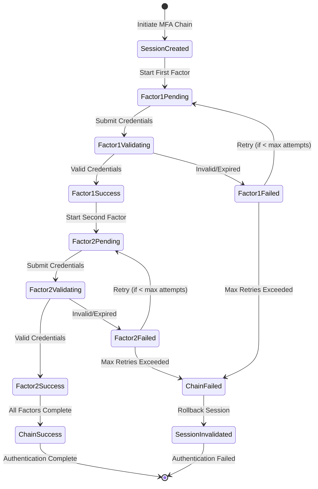
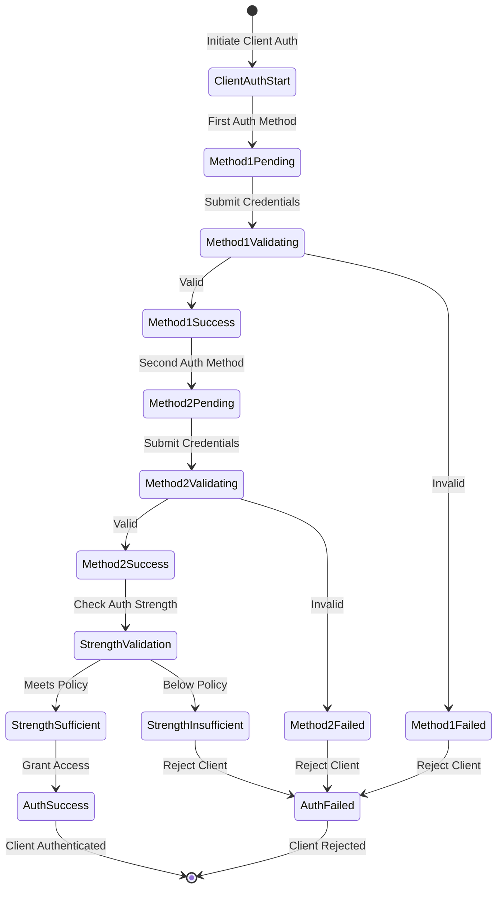
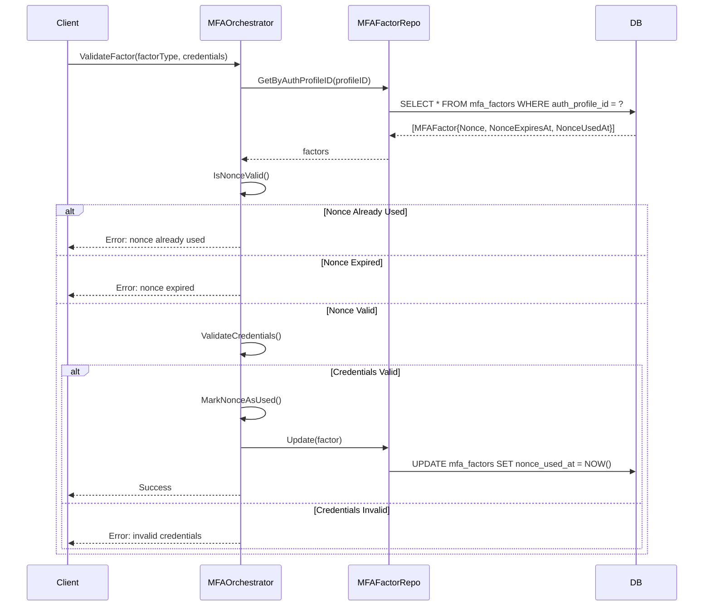
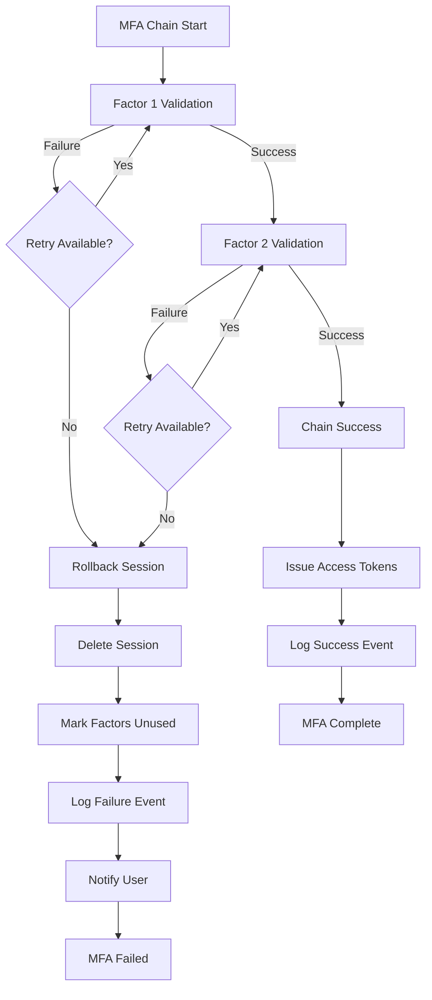

# MFA State Diagrams and Flow Documentation

## Overview

This document describes the multi-factor authentication (MFA) chain execution flows, state transitions, retry policies, and error handling strategies in the Identity System.

## MFA Chain Execution Flow

### User MFA Chain



### Client MFA Chain



## State Transitions

### MFA Factor Validation States

| State | Description | Next States | Timeout |
|-------|-------------|-------------|---------|
| **Pending** | Awaiting factor submission | Validating, Failed | 5 minutes |
| **Validating** | Credential verification | Success, Failed | 30 seconds |
| **Success** | Factor validated successfully | Next Factor, Chain Success | N/A |
| **Failed** | Validation failed (invalid/expired) | Pending (retry), Chain Failed | N/A |

### Session States

| State | Description | Actions Allowed | Cleanup |
|-------|-------------|-----------------|---------|
| **Created** | MFA chain initiated | Start factors | Auto-expire after 10 min |
| **In-Progress** | One or more factors validated | Submit remaining factors | Auto-expire after 10 min |
| **Complete** | All factors validated | Issue tokens | Convert to authenticated session |
| **Failed** | Chain validation failed | None (read-only) | Immediate deletion |
| **Invalidated** | Rollback due to failure | None | Immediate deletion |

## Replay Attack Prevention

### Nonce Lifecycle



### Nonce Validation Rules

1. **Uniqueness**: Each nonce generated via UUIDv7 (time-ordered, globally unique)
2. **Expiration**: Nonces expire after configurable duration (default: 5 minutes)
3. **Single-Use**: Nonce marked as used immediately after successful validation
4. **No Reuse**: Attempts to reuse nonce fail with replay attack error

## Retry Policies

### User MFA Factor Retries

| Factor Type | Max Attempts | Lockout Duration | Backoff Strategy |
|-------------|--------------|------------------|------------------|
| **Password** | 3 | 15 minutes | None (instant rejection after max) |
| **TOTP** | 5 | 5 minutes | None (time-based codes auto-expire) |
| **Email OTP** | 3 | 10 minutes | Exponential (30s, 60s, 120s) |
| **SMS OTP** | 3 | 10 minutes | Exponential (30s, 60s, 120s) |
| **Hardware Key** | 5 | None | None (hardware-enforced) |
| **Biometric** | 5 | None | None (device-enforced) |

### Client Authentication Retries

- **Basic/Post**: 3 attempts, 1-hour lockout after max
- **JWT Assertions**: 5 attempts, 30-minute lockout (allows for clock skew)
- **mTLS**: No limit (certificate validation deterministic)

## Error Handling

### MFA Chain Failure Scenarios



### Partial Success Handling

When MFA chain fails partway through:

1. **Rollback Session**: Set session state to `Invalidated`
2. **Clean Up Factors**: Reset nonce usage for successfully validated factors (allows retry)
3. **Telemetry**: Emit metrics for partial success (helps identify UX friction)
4. **User Notification**: Indicate which factor failed and retry guidance
5. **Audit Log**: Record partial completion for security analysis

## Telemetry and Monitoring

### Key Metrics

| Metric Name | Type | Labels | Description |
|-------------|------|--------|-------------|
| `mfa.validation.total` | Counter | factor_type, success, is_replay | Total MFA validations |
| `mfa.validation.duration` | Histogram | factor_type, success | Validation duration (seconds) |
| `mfa.replay_attempts.total` | Counter | factor_type | Replay attacks detected |
| `mfa.requires_mfa.total` | Counter | auth_profile_id, requires_mfa | RequiresMFA checks |
| `mfa.required_factors.count` | Gauge | auth_profile_id | Number of factors required |

### Distributed Tracing Spans

- **mfa.validate_factor**: Spans entire factor validation (includes DB lookup, credential check, nonce update)
- **mfa.requires_mfa**: Spans RequiresMFA check (DB query for factor count)
- **mfa.get_required_factors**: Spans GetRequiredFactors (DB query and type extraction)

### Structured Logging

```json
{
  "level": "info",
  "time": "2025-01-23T10:30:45Z",
  "msg": "MFA validation completed",
  "factor_type": "totp",
  "success": true,
  "duration_ms": 145,
  "auth_profile_id": "01JQWXYZ123456789ABCDEFGH",
  "trace_id": "4bf92f3577b34da6a3ce929d0e0e4736",
  "span_id": "00f067aa0ba902b7"
}
```

## Concurrency Safety

### Session Isolation Guarantees

- **Database Transactions**: All MFA factor updates use GORM transactions
- **Nonce Atomicity**: Nonce usage marked via single atomic UPDATE
- **Session Locking**: No explicit locks (optimistic concurrency via updated_at timestamps)
- **Parallel Sessions**: Each user session isolated by unique session_id

### Race Condition Prevention

1. **Double Validation**: Two concurrent validations of same factor → first succeeds, second fails (nonce already used)
2. **Session Collision**: Separate session IDs prevent cross-contamination
3. **Database Isolation**: GORM context-aware transactions (`getDB(ctx, baseDB)`) ensure correct DB instance

## Integration with OTLP Stack

### Metrics Export

- **Target**: OpenTelemetry Collector → Prometheus (Grafana)
- **Scrape Interval**: 15 seconds
- **Retention**: 30 days

### Traces Export

- **Target**: OpenTelemetry Collector → Tempo (Grafana)
- **Sampling**: 100% (production: 10% tail-based)
- **Retention**: 7 days

### Logs Export

- **Target**: OpenTelemetry Collector → Loki (Grafana)
- **Format**: JSON structured logs
- **Retention**: 14 days

## Security Considerations

### Time-Bound Nonce Design

- **Prevents Replay**: Nonces expire after short duration (5 minutes)
- **Mitigates Interception**: Even if nonce intercepted, expires before reuse possible
- **Clock Skew Tolerance**: 30-second tolerance for client/server time differences

### Authentication Strength Policies

- **Low**: Single weak factor (password only)
- **Medium**: Single strong factor (TOTP, passkey) OR two weak factors
- **High**: Multiple strong factors (TOTP + hardware key) OR mTLS + JWT

### Audit Trail Requirements

- Log all MFA validation attempts (success and failure)
- Track nonce generation and consumption timestamps
- Record client IP, user agent for risk assessment
- Preserve audit logs for 90 days (compliance requirement)

## References

- **Implementation**: `internal/identity/idp/auth/mfa.go`
- **Telemetry**: `internal/identity/idp/auth/mfa_telemetry.go`
- **Domain Model**: `internal/identity/domain/mfa_factor.go`
- **E2E Tests**: `internal/identity/test/e2e/mfa_concurrency_test.go`, `client_mfa_test.go`
- **Task Documentation**: `docs/02-identityV2/task-11-client-mfa-stabilization.md`
