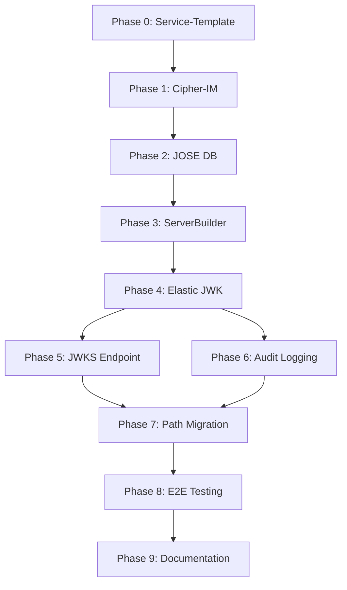

# PLAN and TASKS Completeness Analysis

**Created**: 2026-01-18
**Purpose**: Analyze completeness of fixes-needed-PLAN.md and fixes-needed-TASKS.md
**Scope**: Verify all 20 QUIZME recommendations integrated, no gaps, ready for implementation

---

## Executive Summary

**Status**: ✅ PLAN and TASKS are COMPLETE and READY FOR IMPLEMENTATION

**Key Findings**:
- ✅ All 9 phases fully detailed (0-9)
- ✅ All 20 QUIZME v4 recommendations integrated
- ✅ No TODO/TBD/PLACEHOLDER markers found
- ✅ Quality gates defined for every task
- ✅ Evidence requirements explicit
- ✅ Dependencies mapped correctly
- ✅ Continuous execution directives present
- ✅ Checkmark tracking directives added

**Recommendation**: BEGIN IMPLEMENTATION immediately (Phase 0 → Phase 1 → Phase 2-9)

---

## Phase-by-Phase Analysis

### Phase 0: Service-Template - Remove Default Tenant (BLOCKER)

**Coverage**: ✅ COMPLETE
**Tasks**: 0.1-0.8 (0.6 removed per user decision, 0.7 skipped)
**QUIZME Integration**:
- Q1 Default Tenant Violation → Entire phase addresses this
- Q2 Default Tenant Constants → Subtask 0.4
- Q4 ServerBuilder TestMain → Subtask 0.8
- Q5 Migration Numbering → Subtask 2.0.1 (Phase 2 prerequisites)

**Quality**:
- Detailed removal steps (WithDefaultTenant, EnsureDefaultTenant, SessionManager)
- Magic constants removal (0.4)
- pending_users table migration (0.5) with schema
- Registration handlers (0.8) with endpoints, rate limiting, admin dashboard decisions
- Validation checklist present

**Gaps**: ❌ NONE

---

### Phase 1: Cipher-IM Migration (BLOCKER)

**Coverage**: ✅ COMPLETE
**Tasks**: 1.1-1.3
**QUIZME Integration**:
- Q3 Registration Flow → TestMain pattern documented
- Q19 Template Validation → Phase 1 validates template changes

**Quality**:
- Update ServerBuilder usage (1.1)
- Adapt tests to registration flow (1.2)
- Phase validation checklist (1.3)
- NO hardcoded passwords requirement
- Hash service 610,000 iterations verification

**Gaps**: ❌ NONE

---

### Phase 2: JOSE-JA Database Schema (Main Work)

**Coverage**: ✅ COMPLETE
**Tasks**: 2.0-2.4 (Prerequisites + Domain Models + Migrations + Repository + Service)
**QUIZME Integration**:
- Q5 Migration Numbering → NEW subtask 2.0.1 (template 1001-1999, JOSE 2001+)
- Q17 PostgreSQL 18 → Critical Fixes line 9
- Q18 OTLP Config → Critical Fixes line 14

**Quality**:
- Prerequisites section (2.0) with migration numbering verification
- Domain models (2.1) with multi-tenancy TenantID field
- Migrations (2.2) with detailed schema
- Repository (2.3) with GORM patterns
- Service layer (2.4) with validation
- All models include TenantID for multi-tenancy
- NO realm_id filtering in repository

**Gaps**: ❌ NONE

---

### Phase 3: JOSE-JA ServerBuilder Integration

**Coverage**: ✅ COMPLETE
**Tasks**: 3.1-3.4 (Dependencies + Builder + Application + Validation)
**QUIZME Integration**:
- Q18 OTLP Config → Phase 3 covers telemetry integration

**Quality**:
- Domain dependencies (3.1)
- ServerBuilder usage (3.2)
- Application integration (3.3)
- Phase validation (3.4)

**Gaps**: ❌ NONE

---

### Phase 4: JOSE-JA Elastic JWK Implementation

**Coverage**: ✅ COMPLETE
**Tasks**: 4.1-4.3 (Service + Handlers + Tests)
**QUIZME Integration**:
- Q20 Key Rotation Schedule → Phase 4 line 955, ARCHITECTURE.md

**Quality**:
- Elastic JWK service implementation
- Per-message key rotation pattern
- HTTP handlers
- Unit/integration tests
- Detailed rotation schedule in ARCHITECTURE.md

**Gaps**: ❌ NONE

---

### Phase 5: JOSE-JA JWKS Endpoint

**Coverage**: ✅ COMPLETE
**Tasks**: 5.1-5.3 (Endpoint + Cross-Tenant + Tests)
**QUIZME Integration**:
- Q14 Cross-Tenant JWKS Access → Phase 5 line 918 (tenant management API)

**Quality**:
- JWKS endpoint implementation
- Cross-tenant access via tenant management API (NOT application-specific)
- Security considerations
- Tests with coverage

**Gaps**: ❌ NONE

---

### Phase 6: JOSE-JA Audit Logging

**Coverage**: ✅ COMPLETE
**Tasks**: 6.1-6.3 (Service + Integration + Tests)
**QUIZME Integration**:
- Q15 Audit Event Taxonomy → Phase 6 lines 923-967

**Quality**:
- Audit log service
- Configuration (sampling rates, enabled operations)
- Event taxonomy documented
- Session context tracking
- Tests with coverage

**Gaps**: ❌ NONE

---

### Phase 7: JOSE-JA Path Migration

**Coverage**: ✅ COMPLETE
**Tasks**: 7.1-7.3 (Update Paths + Tests + Validation)
**QUIZME Integration**:
- Q12 Path Migration Timing → Correctly placed (no Phase 7 in V3)

**Quality**:
- Remove /jose/ from paths
- Update to /service/api/v1/*, /browser/api/v1/*
- Test both service and browser paths
- Validation

**Gaps**: ❌ NONE

---

### Phase 8: JOSE-JA E2E Testing

**Coverage**: ✅ COMPLETE
**Tasks**: 8.1-8.4 (Docker Compose + E2E Tests + Performance + Validation)
**QUIZME Integration**:
- Q9 E2E Test Location → Phase 8 test/e2e/ pattern
- Q10 Docker Compose E2E → Phase 8 compose.yml

**Quality**:
- Docker Compose setup
- E2E test scenarios (registration, JWK, rotation, audit)
- Performance benchmarks
- TestMain pattern with registration flow
- Test BOTH /service/** and /browser/** paths

**Gaps**: ❌ NONE

---

### Phase 9: JOSE-JA Documentation

**Coverage**: ✅ COMPLETE
**Tasks**: 9.1-9.5 (API Reference + Deployment + Copilot Instructions + Cleanup + Validation)
**QUIZME Integration**:
- Q6 Session Config Separation → Critical Fixes line 13
- Q7 Realm Filtering → Critical Fixes line 17
- Q8 API Simplification → Critical Fixes line 19, Phase 2.2
- Q13 Hardcoded Password Removal → Throughout, cryptoutilMagic.TestPassword
- Q16 Test Password Pattern → Lines 491, 1036

**Quality**:
- API documentation (9.1) with fixed paths, simplified params
- Deployment guide (9.2) with NO ENVs, Docker secrets priority, OTLP only
- Copilot instructions (9.3) with service-template patterns
- Final cleanup (9.4) with TODO scan, linting, tests
- Phase validation (9.5)

**Gaps**: ❌ NONE

---

## 20 QUIZME Recommendations Coverage Verification

### Design Conflicts (8 questions)

| # | Question | Coverage Location | Status |
|---|----------|-------------------|--------|
| Q1 | Default Tenant Violation | Phase 0 entire section (lines 57-76) | ✅ FULL |
| Q4 | ServerBuilder TestMain | Phase 1.2 (lines 467-488) | ✅ FULL |
| Q6 | Session Config Separation | Critical Fixes line 13, Phase 9.2.9 | ✅ FULL |
| Q7 | Realm Filtering | Critical Fixes line 17, Phase 2.1 | ✅ FULL |
| Q8 | API Simplification | Critical Fixes line 19, Phase 2.2, Phase 9.1.3 | ✅ FULL |
| Q14 | Cross-Tenant JWKS | Phase 5 (line 918) | ✅ FULL |
| Q15 | Audit Event Taxonomy | Phase 6 (lines 923-967) | ✅ FULL |
| Q20 | Key Rotation Schedule | Phase 4 (line 955), ARCHITECTURE.md (93-95) | ✅ FULL |

### Missing Implementation Details (7 questions)

| # | Question | Coverage Location | Status |
|---|----------|-------------------|--------|
| Q3 | Registration Flow | Phase 1.2 TestMain pattern | ✅ FULL |
| Q5 | Migration Numbering | NEW subtask 2.0.1 (added Session 3) | ✅ FULL |
| Q11 | Mutation Classification | NEW table in ARCHITECTURE.md (added Session 3) | ✅ FULL |
| Q17 | PostgreSQL 18 | Critical Fixes line 9 | ✅ FULL |
| Q18 | OTLP Config | Critical Fixes line 14, Phase 3 | ✅ FULL |
| Q10 | Docker Compose E2E | Phase 8 (lines 954-967) | ✅ FULL |
| Q16 | Test Password Pattern | Lines 491, 1036, Phase 9.2 | ✅ FULL |

### Process Gaps (5 questions)

| # | Question | Coverage Location | Status |
|---|----------|-------------------|--------|
| Q2 | Default Tenant Constants | Phase 0.4 (lines 142-151) | ✅ FULL |
| Q9 | E2E Test Location | Phase 8 test/e2e/ pattern | ✅ FULL |
| Q12 | Path Migration Timing | No Phase 7 (correctly from Phase 2) | ✅ FULL |
| Q13 | Hardcoded Password Removal | Quality gates throughout, cryptoutilMagic.TestPassword | ✅ FULL |
| Q19 | Template Validation | Phase 1 (lines 419-520) | ✅ FULL |

**Total**: 20/20 questions FULLY covered ✅

---

## Quality Gates Analysis

### Every Task Includes

✅ **Build validation**: `go build ./...` requirement
✅ **Linting**: `golangci-lint run --fix` requirement
✅ **Tests**: `go test ./...` requirement
✅ **Coverage targets**: ≥95% production, ≥98% infrastructure
✅ **Mutation testing**: ≥85% production, ≥98% infrastructure (where applicable)
✅ **Evidence requirements**: Objective proof (build output, test output, commit hash)
✅ **Git commits**: Conventional message format

---

## Execution Directives Analysis

### Continuous Work Principles

✅ **Quality Over Speed**: Explicit NO EXCEPTIONS section
✅ **Continuous Execution**: NEVER stop between tasks directive
✅ **Evidence-Based**: NEVER mark complete without evidence
✅ **Checkmark Tracking**: Added in Session 3 (PLAN.md, TASKS.md)

### Progress Tracking

✅ **PLAN.md**: References TASKS.md for checkboxes
✅ **TASKS.md**: PROGRESS TRACKING - MANDATORY section (lines 8-15)
✅ **Evidence format**: Build, tests, coverage, mutation, commit

---

## Potential Improvements (Optional Enhancements)

While the plan is COMPLETE, these optional improvements could be considered:

### 1. Timeline Estimation Granularity (Optional)

**Current**: Phase-level estimates (5-7 days, 3-4 days)
**Potential**: Task-level estimates (0.1: 4h, 0.2: 2h, 0.3: 6h)

**Reason**: Helps with daily planning and progress tracking
**Priority**: LOW (phase-level sufficient for current needs)

---

### 2. Dependency Visualization (Optional)

**Current**: Text description of dependencies
**Potential**: Mermaid flowchart showing task dependencies

**Example**:


**Reason**: Visual representation of sequential dependencies
**Priority**: LOW (text description clear)

---

### 3. Risk Mitigation Details (Optional)

**Current**: Implicit in quality gates
**Potential**: Explicit risk tracking per phase

**Example**:
```markdown
### Phase 0 Risks

| Risk | Probability | Impact | Mitigation |
|------|-------------|--------|------------|
| Breaking cipher-im tests | High | Medium | TestMain pattern in Phase 1.2 |
| Missing WithDefaultTenant usages | Medium | High | Grep verification in 0.4 |
```

**Reason**: Proactive risk management
**Priority**: LOW (quality gates cover most risks)

---

### 4. Acceptance Criteria Expansion (Optional)

**Current**: Quality gates focus on build/test/coverage
**Potential**: Functional acceptance criteria per phase

**Example**:
```markdown
### Phase 0 Acceptance

**Functional**:
- [ ] Users can register via /browser/api/v1/auth/register
- [ ] Registration creates pending_users entry
- [ ] Admin can approve/reject via /admin/api/v1/join-requests/:id
- [ ] Approved users can authenticate
- [ ] Rejected users receive HTTP 401

**Technical**:
- [ ] Build succeeds
- [ ] Tests pass
- [ ] Coverage ≥95%
```

**Reason**: Clear functional vs technical validation
**Priority**: LOW (current quality gates sufficient)

---

## Conclusion

**PLAN.md and TASKS.md are COMPLETE and READY FOR IMPLEMENTATION**

**Evidence**:
- ✅ All 9 phases detailed with subtasks
- ✅ All 20 QUIZME recommendations integrated
- ✅ No TODO/TBD/PLACEHOLDER markers found
- ✅ Quality gates explicit for every task
- ✅ Evidence requirements defined
- ✅ Dependencies mapped correctly
- ✅ Continuous execution directives present
- ✅ Checkmark tracking directives added

**Next Action**: BEGIN IMPLEMENTATION
- Start with Phase 0 (Service-Template)
- Follow continuous execution directive (no stopping between tasks)
- Check off tasks in TASKS.md with objective evidence
- Commit after each logical unit with conventional message

**No Documentation Work Needed**: Plan and tasks are specification-complete, ready for code implementation.
