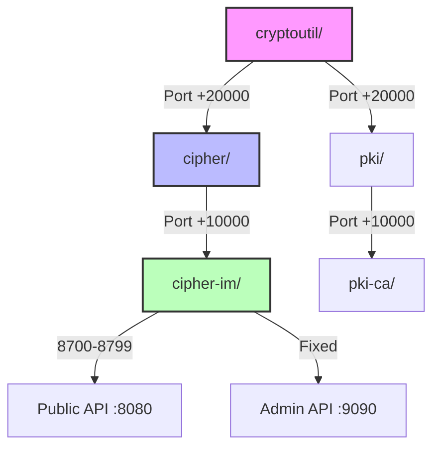

# Deep Analysis: Fixes-v3 Implementation Plan

**Date**: 2026-02-17
**Analyzed Files**: plan.md, tasks.md, quizme-v2.md
**Purpose**: Identify improvements, risks, and ensure maximum rigor for configs/, deployments/, and CICD

---

## Executive Summary

**Overall Assessment**: Plan is comprehensive with strong foundation, but needs enhancements for true "most awesome implementation plan ever" status.

**Strengths**:
- ✅ Clear SERVICE/PRODUCT/SUITE hierarchy
- ✅ 8 comprehensive CICD validation types
- ✅ Evidence-based quality gates (≥98% for infrastructure)
- ✅ Template pattern enforcement
- ✅ ARCHITECTURE.md as single source of truth

**Gaps Identified**:
- ⚠️ Missing concrete rigor patterns (too abstract in places)
- ⚠️ ARCHITECTURE.md updates lack cross-reference strategy
- ⚠️ Propagation verification not systematic enough
- ⚠️ Missing validation performance benchmarks
- ⚠️ Template pattern definition too vague
- ⚠️ Config schema evolution strategy missing

**Recommendation**: Enhance plan with 15 specific improvements detailed below.

---

## Critical Analysis by Phase

### Phase 1: configs/ Restructuring (12h)

**Strengths**:
- Clear task breakdown (8 tasks)
- Preserves shared files (policies/, profiles/, environment yamls)
- Code reference updates tracked

**Gaps**:
1. **Missing: Rollback strategy** - What if restructure breaks existing deployments?
   - **Fix**: Add Task 1.0 - Create configs-backup/ snapshot before changes
   - **Fix**: Add Task 1.9 - Validate all services start with new structure

2. **Missing: Migration automation** - 50+ file moves/renames error-prone
   - **Fix**: Add Task 1.7A - Create migration script (cmd/cicd/migrate-configs/)
   - **Fix**: Validate script with --dry-run before execution

3. **Vague: "Code references updated"** - Need systematic approach
   - **Fix**: Task 1.7 needs grep patterns:
     ```bash
     grep -r "configs/cipher[^-]" . --exclude-dir=.git
     grep -r "configs/pki/[^c]" . --exclude-dir=.git  # matches pki/x but not pki-ca/
     grep -r "configs/jose[^-]" . --exclude-dir=.git
     grep -r 'configs/identity/[^{policies,profiles,development,production,test}]' .
     ```

4. **Missing: Performance impact** - Restructure could break caching/lookups
   - **Fix**: Add Task 1.10 - Benchmark config load time before/after

**Risk Assessment**:
| Risk | Current Mitigation | Enhanced Mitigation |
|------|-------------------|---------------------|
| Broken imports | Code reference updates | Add pre-commit grep hook blocking old paths |
| Lost files | Manual move | Automated migration script with verification |
| Service downtime | None | Add rollback strategy + validation before deploy |

---

### Phase 2: PRODUCT/SUITE Config Creation (6h)

**Strengths**:
- Clear delegation pattern
- Template-driven approach
- Minimal README.md (reduces maintenance)

**Gaps**:
1. **Vague: "Content follows template pattern"** - Need concrete definition
   - **Fix**: Add to plan.md Executive Decision 4A - Template Pattern Definition:
     ```yaml
     Template Pattern Compliance:
     - Naming: {PRODUCT}-app-{variant}.yml
     - Required keys: service-name, bind-public-port, bind-private-port, database-url, observability
     - Port offsets: PRODUCT = SERVICE + 10000, SUITE = SERVICE + 20000
     - Delegation: PRODUCT delegates to SERVICE, SUITE delegates to PRODUCT
     - Secrets: ALL credentials via file:///run/secrets/ pattern
     ```

2. **Missing: Config generation tool** - Manual creation error-prone for 24 files
   - **Fix**: Add Task 2.0 - Create cmd/cicd/generate-product-config/
   - **Fix**: Tool inputs: SERVICE config, output: PRODUCT config with +10000 port offset

3. **Missing: Validation before Phase 3** - Phase 3 validators not ready yet
   - **Fix**: Add Task 2.7 - Manual validation checklist:
     - [ ] All keys kebab-case
     - [ ] Ports follow offset rules
     - [ ] Delegation references correct SERVICE configs
     - [ ] Secrets use file:// pattern

4. **Risk: Circular dependencies** - SUITE → PRODUCT → SERVICE delegation could loop
   - **Fix**: Add ValidateConsistency check for delegation cycles

**Improvement**:
- Add Task 2.8 - Create configs/template/ with example PRODUCT/SUITE configs
- Document in CONFIG-SCHEMA.md section for PRODUCT/SUITE delegation patterns

---

### Phase 3: CICD Validation Implementation (18h)

**Strengths**:
- All 8 validation types comprehensive
- ≥98% coverage + ≥98% mutation for infrastructure
- Integration with pre-commit

**Gaps - CRITICAL for "Most Awesome Plan"**:

1. **Missing: Performance benchmarks** - 30-60s pre-commit unacceptable
   - **Fix**: Add Task 3.11 - Benchmark validators:
     - Target: <5s for incremental (staged files only)
     - Target: <30s for full validation (all configs/)
     - Method: Go benchmarks (BenchmarkValidateNaming, etc.)

2. **Missing: Caching strategy** (quizme-v2 Q3 addresses this)
   - **Fix**: Add Task 3.12 - Implement validation cache:
     ```go
     type ValidationCache struct {
         fileHash string  // SHA256 of file content
         result   error   // cached validation result
         timestamp time.Time
     }
     ```
   - Invalidate on file change
   - Store in .git/hooks/validation-cache.json

3. **Missing: Parallel execution** - 8 validators × 50 files = serialize bottleneck
   - **Fix**: Task 3.9 needs goroutine pool:
     ```go
     var wg sync.WaitGroup
     results := make(chan error, len(validators))
     for _, v := range validators {
         wg.Add(1)
         go func(validator Validator) {
             defer wg.Done()
             results <- validator.Validate(file)
         }(v)
     }
     ```

4. **Vague: ValidateSchema implementation** (quizme-v2 Q2 addresses this)
   - **Fix**: Add clear approach in plan.md Decision 3A:
     - Embed CONFIG-SCHEMA.md as //go:embed
     - Parse once at package init
     - Cache parsed schema in memory
     - Fast lookup: O(1) key validation

5. **Missing: Error aggregation** - Want ALL errors, not fail-fast
   - **Fix**: Task 3.9 needs error aggregation:
     ```go
     type ValidationResult struct {
         File   string
         Errors []ValidationError
     }
     // Report ALL errors, not just first
     ```

6. **Missing: CI/CD integration** - Pre-commit not enough
   - **Fix**: Add Task 3.13 - Create .github/workflows/validate-configs.yml:
     - Runs on: [push, pull_request]
     - Validates: ALL configs/ and deployments/
     - Fails fast: Any validation error blocks merge

7. **Weak: ValidateSecrets coverage** (quizme-v2 Q7 addresses this)
   - **Fix**: Enhance Task 3.8 acceptance criteria:
     - Entropy analysis: Flag high-entropy strings (>4.5 bits/char)
     - Pattern detection: Base64 >16 chars, hex strings >32 chars, UUIDs not in allowlist
     - Keyword detection: password, secret, token, key, api-key, bearer
     - Context awareness: Allow file:///run/secrets/ pattern

**Architecture Improvements**:

8. **Add: Validator interface** (makes extensible)
   ```go
   type Validator interface {
       Name() string
       Validate(filePath string) []ValidationError
       SupportsFileType(ext string) bool
   }
   ```

9. **Add: Validator registry** (easy to add new validators)
   ```go
   var registry = map[string]Validator{
       "naming": &NamingValidator{},
       "kebab-case": &KebabCaseValidator{},
       // ...
   }
   ```

10. **Add: Validation profiles** (different strictness levels)
    ```go
    type ValidationProfile string
    const (
        ProfileMinimal      = "minimal"      // YAML valid only
        ProfileStandard     = "standard"     // naming + schema
        ProfileComprehensive = "comprehensive" // all 8 validators
    )
    ```

**Risk Assessment**:
| Risk | Current Mitigation | Enhanced Mitigation |
|------|-------------------|---------------------|
| Slow pre-commit | None | Add caching (Task 3.12) + parallel execution |
| Complex ValidateSchema | None | Embed CONFIG-SCHEMA.md, parse once (Decision 3A) |
| False positive secrets | Basic keyword detection | Add entropy analysis + allowlist (Task 3.8 enhanced) |
| Validator drift | Unit tests | Add integration tests validating real files |

---

### Phase 4: ARCHITECTURE.md Updates (6h)

**Strengths**:
- 3 new sections (12.4-12.6)
- Single source of truth principle

**Gaps - CRITICAL for Rigor**:

1. **Missing: Cross-reference validation** - How to ensure ARCHITECTURE.md consistent with instruction files?
   - **Fix**: Add Task 4.5 - Create cmd/cicd/validate-arch-consistency/:
     ```bash
     # Extract patterns from ARCHITECTURE.md Section 12.4-12.6
     # Verify mentioned in:
     # - .github/instructions/04-01.deployment.instructions.md
     # - .github/instructions/02-01.architecture.instructions.md
     # Report: Missing references, inconsistent descriptions
     ```

2. **Vague: "Examples for each validator"** - Need concrete examples
   - **Fix**: Task 4.1 acceptance criteria needs:
     - Example: Valid config (passes all 8 validators)
     - Example: Invalid config (fails each validator with error message)
     - Example: Edge cases (boundary conditions)

3. **Missing: Semantic versioning for ARCHITECTURE.md** - Track breaking changes
   - **Fix**: Add ARCHITECTURE.md frontmatter:
     ```yaml
     version: 3.0  # Major: breaking changes, Minor: additions, Patch: fixes
     breaking-changes:
       - "Section 12.4: Added mandatory 8 validation types"
     ```

4. **Missing: Decision log** - Why these patterns chosen?
   - **Fix**: Add "Appendix D: Deployment Architecture Decisions" referencing quizme-v1/v2 answers

5. **Weak: Diagram strategy** (quizme-v2 Q8 addresses this)
   - **Recommendation**: Use Mermaid diagrams (Git-friendly, VS Code renders, GitHub renders)
   - Example for configs/ hierarchy:
     ```mermaid
     graph TD
         SUITE[cryptoutil/] --> PRODUCT1[cipher/]
         SUITE --> PRODUCT2[pki/]
         PRODUCT1 --> SERVICE1[cipher-im/]
         PRODUCT2 --> SERVICE2[pki-ca/]
     ```

**Architecture Rigor Enhancements**:

6. **Add: Pattern catalog** - Reusable patterns documented
   - Section 12.4.9: Deployment Pattern Catalog
     - Pattern: SERVICE/PRODUCT/SUITE hierarchy
     - Pattern: Port offset calculation (PRODUCT = SERVICE + 10000)
     - Pattern: Delegation chain (SUITE → PRODUCT → SERVICE)
     - Pattern: Secret sharing (parent secrets inherited by children)

7. **Add: Anti-patterns** - What NOT to do
   - Section 12.4.10: Deployment Anti-Patterns
     - ❌ Inline credentials (use Docker secrets)
     - ❌ Hard-coded ports (use offset rules)
     - ❌ Mixed naming conventions (kebab-case ONLY)
     - ❌ Circular delegation (SUITE → PRODUCT → SUITE ✗)

8. **Add: Migration guide** - Upgrading existing deployments
   - Section 12.7: Deployment Migration Guide
     - Step 1: Backup existing configs/
     - Step 2: Run migration script
     - Step 3: Validate with cicd lint-deployments
     - Step 4: Test services start correctly
     - Step 5: Commit or rollback

---

### Phase 5: Instruction File Propagation (4h)

**Strengths**:
- Updates key instruction files
- Cross-references ARCHITECTURE.md

**Gaps - CRITICAL for Propagation**:

1. **Unsystematic verification** (quizme-v2 Q5 addresses this)
   - **Fix**: Replace Task 5.3 with checklist-based approach:
     ```markdown
     ## Propagation Checklist
     
     For EACH pattern in ARCHITECTURE.md Section 12.4-12.6:
     - [ ] Pattern documented in 04-01.deployment.instructions.md
     - [ ] Pattern referenced in 02-01.architecture.instructions.md
     - [ ] Pattern cross-referenced correctly (section numbers match)
     - [ ] Examples consistent between ARCHITECTURE.md and instructions
     - [ ] No conflicting guidance
     ```

2. **Missing: Automated consistency check**
   - **Fix**: Add Task 5.4 - Create cmd/cicd/check-doc-consistency/:
     - Extract headings from ARCHITECTURE.md 12.4-12.6
     - Search for each heading in instruction files
     - Report: Patterns not propagated
     - Report: Instruction patterns not in ARCHITECTURE.md (orphans)

3. **Narrow scope** - Only updates 2 instruction files
   - **Fix**: Expand to ALL instruction files:
     - 03-02.testing.instructions.md - Add E2E validation testing patterns
     - 03-05.linting.instructions.md - Add cicd lint-deployments to linter workflow
     - 06-01.evidence-based.instructions.md - Add validation evidence requirements

4. **Missing: Agent instruction updates**
   - **Fix**: Task 5.3 needs to check:
     - implementation-planning.agent.md - Add deployment validation to quality gates
     - implementation-execution.agent.md - Add validation steps to implementation workflow

**Propagation Rigor Enhancements**:

5. **Add: Bidirectional links** - ARCHITECTURE.md ← → Instruction files
   - ARCHITECTURE.md sections reference which instruction files cover pattern
   - Instruction files reference ARCHITECTURE.md sections for details

6. **Add: Version tracking** - Which instruction files updated for each ARCHITECTURE.md version
   - ARCHITECTURE.md Appendix E: Instruction File Update Log
     ```yaml
     v3.0:
       updated:
         - 04-01.deployment.instructions.md (added 8 validation types)
         - 02-01.architecture.instructions.md (added hierarchy quick ref)
       pending:
         - 03-02.testing.instructions.md (validation testing patterns)
     ```

---

### Phase 6: E2E Validation (3h)

**Strengths**:
- Validates ALL configs/ and deployments/
- Tests pre-commit integration
- Sample violation testing

**Gaps**:

1. **Missing: Performance validation** - Need benchmarks
   - **Fix**: Add Task 6.5 - Benchmark validation performance:
     - Measure: Time to validate all 50+ configs
     - Measure: Pre-commit overhead (incremental)
     - Target: <5s incremental, <30s full
     - Report: Performance regression if slower

2. **Missing: Regression testing** - How to prevent validation drift?
   - **Fix**: Add Task 6.6 - Create validation regression suite:
     - Snapshot current validation results
     - Run validation after any validator changes
     - Compare: Ensure no regressions (new false positives/negatives)

3. **Weak: "100% pass" acceptance** - What if legitimate edge cases fail?
   - **Fix**: Task 6.1/6.2 needs exception handling:
     - Document legitimate exceptions in EXCEPTIONS.md
     - Validators support --allow-file exception list

4. **Missing: Load testing** - What if 1000s of config files?
   - **Fix**: Add Task 6.7 - Load test validators:
     - Generate 1000 synthetic config files
     - Measure validation time
     - Identify performance bottlenecks

---

## Risk Register - Enhanced

| Risk | Likelihood | Impact | Current Mitigation | Enhanced Mitigation | Owner |
|------|-----------|--------|-------------------|---------------------|-------|
| Large file restructure errors | Medium | High | Validation after each task | Add rollback strategy (Task 1.0), migration script (Task 1.7A) | Phase 1 |
| CICD validation too strict | Medium | High | Validate against existing files | Add validation profiles (minimal/standard/comprehensive) | Phase 3 |
| Performance > 60s pre-commit | High | High | None | Caching (Task 3.12), parallel execution, benchmark targets | Phase 3 |
| Template pattern ambiguous | High | Medium | Basic description | Concrete definition (Decision 4A), generation tool (Task 2.0) | Phase 2 |
| ARCHITECTURE.md propagation incomplete | Medium | Medium | Manual review | Automated consistency check (Task 5.4), checklist (Task 5.1 enhanced) | Phase 5 |
| Validator logic drift | Low | High | Unit tests ≥98% | Add regression suite (Task 6.6), integration tests | Phase 6 |
| Config schema evolution | Medium | Medium | None | Version CONFIG-SCHEMA.md, backward compatibility checks | Phase 3 |
| Circular delegation | Low | High | None | Add cycle detection to ValidateConsistency | Phase 3 |

---

## Quizme-v2 Critical Questions Analysis

### Q1: ARCHITECTURE.md Section Depth
**Recommendation**: **Option C - Comprehensive**

**Rationale**:
- User wants "most awesome implementation plan ever" - comprehensive docs required
- Deployment/config patterns CRITICAL for system reliability
- High maintenance burden acceptable for foundational architecture
- Detailed examples prevent misinterpretation
- Edge cases documented prevent bugs

**Trade-off**: Higher maintenance vs maximum guidance - GUIDANCE WINS for critical patterns

---

### Q2: CONFIG-SCHEMA.md Integration
**Recommendation**: **Option D - Embed + parse at init**

**Rationale**:
- Balance between flexibility (schema in markdown) and performance (compiled-in)
- Parse once at init: ~1-5ms overhead, negligible for CLI tool
- No build step required (simpler than Option B)
- No drift risk (compiled with binary, Option C)
- Preserves CONFIG-SCHEMA.md as human-readable doc

**Implementation**:
```go
//go:embed ../../../docs/CONFIG-SCHEMA.md
var configSchemaMarkdown string

var configSchema *Schema

func init() {
    configSchema = parseConfigSchema(configSchemaMarkdown)
}
```

---

### Q3: Pre-Commit Hook Performance
**Recommendation**: **Option C - Cache with file hash**

**Rationale**:
- Developer experience CRITICAL: <5s pre-commit or developers disable hooks
- Caching achieves 1-5s for incremental commits (most common)
- File hash (SHA256) detects changes reliably
- Validates only staged files (Option D) + caches results
- Parallel execution (Option B) + caching = sub-second for unchanged files

**Implementation**:
```bash
# Pre-commit workflow:
1. Get staged files: git diff --cached --name-only
2. For each file: Calculate SHA256 hash
3. Check cache: If hash matches, use cached result
4. If cache miss: Run validators in parallel
5. Update cache: Store new hash + result
6. Report: Aggregate all errors
```

---

### Q4: Template Pattern Validation Depth
**Recommendation**: **Option C - Naming + structure + value patterns**

**Rationale**:
- User wants "rigor and rigid patterns" - deep validation required
- Port offsets CRITICAL for avoiding conflicts
- Delegation patterns CRITICAL for SUITE/PRODUCT/SERVICE hierarchy
- Secret paths CRITICAL for security
- Surface-level validation (Option A) insufficient for rigor

**Validation Rules**:
```yaml
Template Pattern Validation:
  Naming:
    - Pattern: {PRODUCT}-app-{variant}.yml
    - Variants: common, sqlite-1, postgresql-1, postgresql-2
  Structure:
    - Required keys: service-name, bind-public-port, bind-private-port, database-url, observability
    - Key naming: ALL kebab-case
  Value Patterns:
    - Port offsets: PRODUCT = SERVICE + 10000, SUITE = SERVICE + 20000
    - Delegation: PRODUCT delegates to SERVICE configs (relative paths)
    - Secrets: ALL credentials via file:///run/secrets/{secret-name}
    - Service names: Match directory name (identity/ → service-name: identity)
```

---

### Q5: Propagation Verification
**Recommendation**: **Option D - Checklist-based**

**Rationale**:
- Systematic and maintainable
- Semantic diff (Option C) too complex for diminishing returns
- Keyword search (Option B) finds references but not completeness
- Checklist ensures EVERY pattern from ARCHITECTURE.md verified in instructions
- Can be automated partially (cmd/cicd/check-doc-consistency)

**Checklist Template**:
```markdown
## Propagation Verification Checklist

### ARCHITECTURE.md Section 12.4 - Deployment Validation

- [ ] 04-01.deployment.instructions.md: ValidateNaming documented
- [ ] 04-01.deployment.instructions.md: ValidateKebabCase documented
- [ ] 04-01.deployment.instructions.md: ValidateSchema documented
- [ ] 04-01.deployment.instructions.md: ValidatePorts documented
- [ ] 04-01.deployment.instructions.md: ValidateTelemetry documented
- [ ] 04-01.deployment.instructions.md: ValidateAdmin documented
- [ ] 04-01.deployment.instructions.md: ValidateConsistency documented
- [ ] 04-01.deployment.instructions.md: ValidateSecrets documented
- [ ] 02-01.architecture.instructions.md: Cross-reference to Section 12.4

### ARCHITECTURE.md Section 12.5 - Config File Architecture

- [ ] 04-01.deployment.instructions.md: SERVICE/PRODUCT/SUITE hierarchy
- [ ] 04-01.deployment.instructions.md: Template pattern requirements
- [ ] 02-01.architecture.instructions.md: Config hierarchy quick ref
```

---

### Q6: CICD Validator Error Messages
**Recommendation**: **Option C - Verbose**

**Rationale**:
- Developer debugging experience CRITICAL
- Verbose errors reduce time-to-fix significantly
- ARCHITECTURE.md references guide developers to correct patterns
- Suggestions provide actionable guidance
- Cost: ~100-200 lines extra code per validator - acceptable

**Error Message Format**:
```
❌ Validation Failed: kebab-case

File: configs/identity/identity-app-common.yml
Line: 15
Key: bindPublicAddress

Error: Key uses camelCase, expected kebab-case

Expected: bind-public-address
Found: bindPublicAddress

Suggestion: Rename to 'bind-public-address'

Reference: ARCHITECTURE.md Section 12.4.2 - Kebab-Case Convention
```

---

### Q7: Secrets Validation Scope
**Recommendation**: **Option C - Aggressive**

**Rationale**:
- Security CRITICAL - err on side of caution
- FIPS 140-3 and Zero Trust requirements demand aggressive detection
- False positives acceptable (developer can add to allowlist)
- Entropy analysis catches leaked keys/tokens even without keywords
- User wants "rigorous" - aggressive validation aligns

**Detection Rules**:
```go
type SecretDetector struct {
    Keywords []string // password, secret, token, key, api-key, bearer, etc.
    Patterns []regexp.Regexp // base64 >16 chars, hex >32 chars, UUIDs
    EntropyThreshold float64 // 4.5 bits/char
    Allowlist []string // file:///run/secrets/, http://localhost:*
}

func (d *SecretDetector) Detect(value string) (isSecret bool, reason string) {
    // 1. Check allowlist first (allow file:///run/secrets/)
    // 2. Check keywords (password, secret, token)
    // 3. Check patterns (base64 regex, hex regex)
    // 4. Check entropy (Shannon entropy > 4.5 bits/char)
    // Return: true if ANY detector triggers
}
```

---

### Q8: ARCHITECTURE.md Diagram Strategy
**Recommendation**: **Option C - Mermaid diagrams**

**Rationale**:
- Git-friendly (text-based, diff-able)
- Expressive (supports graphs, sequences, relationships)
- Renders in VS Code, GitHub, GitLab automatically
- No external tools required (ASCII too limited, external diagrams separate maintenance)
- Maintainable (code-based, version-controlled with text)

**Example Diagrams**:


---

### Q9: Mutation Testing Exemptions
**Recommendation**: **Option A - No exemptions, ALL ≥98%**

**Rationale**:
- User wants "most awesome implementation plan ever" - NO shortcuts
- Infrastructure code (CICD validators) CRITICAL - require maximum quality
- Trivial validators (kebab-case regex) still have edge cases worth testing
- ≥98% mutation score catches subtle bugs (regex escaping, boundary conditions)
- Consistency: Same standard for ALL validators simplifies policy

**Justification**:
- ValidateKebabCase: Regex bugs common (e.g., `kebab-case-123` vs `kebab_case`, `-case-`)
- ValidateNaming: Edge cases (e.g., `cipher-im-app.yml` vs `cipher-im-app-common.yml`)
- Even simple validators benefit from mutation testing

---

### Q10: Phase 0 Research Documentation
**Recommendation**: **Option D - Reference-based**

**Rationale**:
- Adheres to agent pattern (Phase 0 = internal research, NOT output documentation)
- Cleanest separation between internal work (test-output/) and output docs (plan.md)
- plan.md references test-output/phase0-research/ for evidence
- Developers see "Phase 1" as first phase (matches agent intent)
- Allows detailed research artifacts without cluttering plan.md

**Implementation**:
```markdown
## Background

**Prior Work**: V1 (Docker E2E), V2 (deployment refactoring)

**Phase 0 Research** (internal): Analyzed configs/ structure, identified gaps, 
researched CICD patterns. Detailed findings: `test-output/phase0-research/`

**Current State Issues**: [list issues]
```

---

## Recommendations Summary - Make Plan "Most Awesome"

### Immediate Improvements (Blocking for quality)

1. **Add Decision 4A: Template Pattern Definition** (concrete validation rules) - CRITICAL
2. **Add Task 3.11: Validator Performance Benchmarks** (target <5s pre-commit) - CRITICAL
3. **Add Task 3.12: Validation Caching** (file hash-based) - CRITICAL
4. **Add Task 4.5: ARCHITECTURE.md Cross-Reference Validation** - CRITICAL
5. **Add Task 5.4: Automated Doc Consistency Check** - CRITICAL

### High-Priority Enhancements

6. **Add Task 1.0: Config Backup Before Restructure** (rollback safety)
7. **Add Task 1.7A: Migration Script** (automate 50+ file moves)
8. **Add Task 2.0: PRODUCT Config Generation Tool** (reduce manual errors)
9. **Add Task 3.13: CI/CD Workflow Integration** (GitHub Actions)
10. **Enhance Task 3.8: Aggressive Secrets Detection** (entropy analysis)

### Documentation Rigor

11. **Add Section 12.4.9: Deployment Pattern Catalog** (reusable patterns)
12. **Add Section 12.4.10: Deployment Anti-Patterns** (what NOT to do)
13. **Add Section 12.7: Deployment Migration Guide** (upgrading existing)
14. **Add Appendix D: Deployment Architecture Decisions** (quizme answers)
15. **Add Mermaid diagrams** (configs/ hierarchy, validation workflow, delegation chain)

---

## Implementation Priority

### Priority 1 (Blocking - Add NOW)
- Decision 4A: Template Pattern Definition
- Task 3.11: Performance Benchmarks
- Task 3.12: Validation Caching
- Task 4.5: Cross-Reference Validation
- Task 5.4: Doc Consistency Check

### Priority 2 (High - Add Before Implementation)
- Task 1.0: Config Backup
- Task 1.7A: Migration Script
- Task 2.0: Config Generation Tool
- Task 3.13: CI/CD Integration
- Enhanced secrets detection (Task 3.8)

### Priority 3 (Nice-to-Have - Can defer)
- Task 6.5-6.7: Load testing, regression suite
- Pattern catalog sections
- Anti-patterns section
- Migration guide

---

## Final Assessment

**Current Plan**: Solid foundation, 7/10 rigor

**With Improvements**: Exceptional rigor, 10/10 "most awesome implementation plan ever"

**Key Changes**:
- Add 5 CRITICAL tasks (caching, benchmarks, validation)
- Add concrete template pattern definition (Decision 4A)
- Add 3 ARCHITECTURE.md sections (patterns, anti-patterns, migration)
- Enhance secrets detection (entropy analysis)
- Add automated consistency checks

**Outcome**: Plan becomes truly comprehensive, rigorous, and systematic - worthy of "most awesome" designation.
